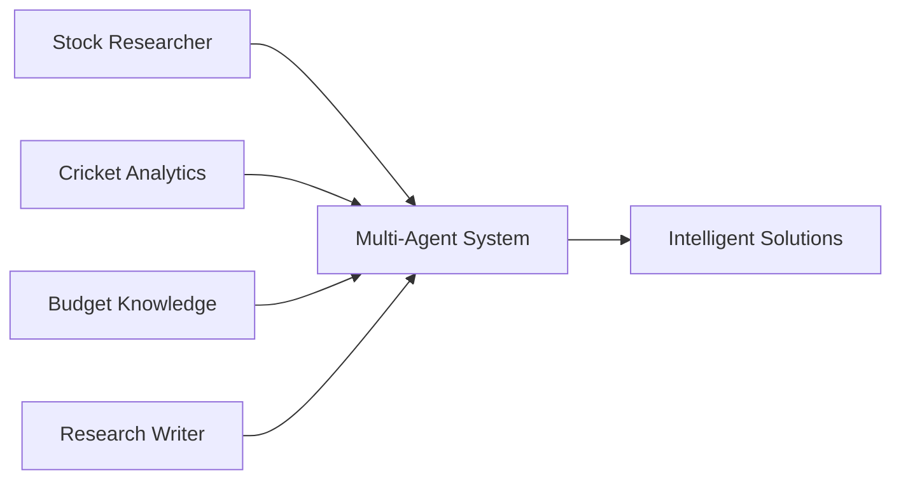
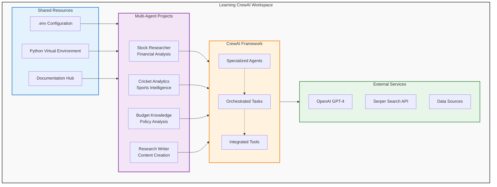
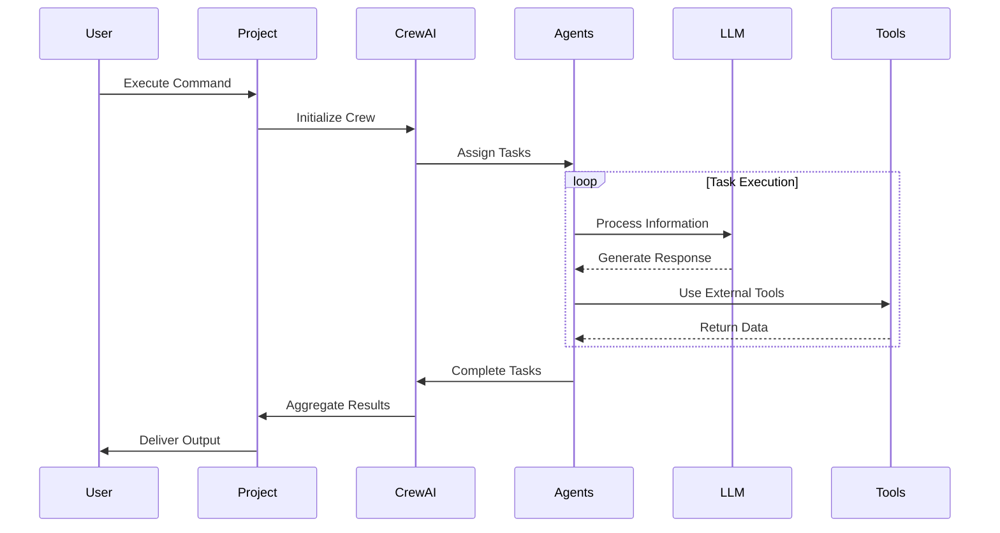

# Learning CrewAI - Multi-Agent AI System Projects

<div align="center">


[](https://www.python.org/downloads/)
[](https://crewai.com)
[](LICENSE)
[](README.md)

</div>

---

<div align="center">

### **Intelligent Multi-Agent Collaboration** | **Production-Ready Systems** | **Real-World Applications**

</div>

---

> A comprehensive collection of enterprise-grade, multi-agent AI systems built with [CrewAI](https://crewai.com). Each project demonstrates collaborative AI agents solving complex real-world problems through intelligent task orchestration and domain-specific expertise.

---

## Overview

<div align="center">



</div>

This workspace contains multiple CrewAI projects that showcase advanced multi-agent AI capabilities:

- **Stock Researcher**: Financial analysis with S&P 500 benchmarking and investment recommendations
- **Cricket Performance Analysis**: Sports analytics with player performance metrics and visualizations
- **Union Budget Knowledge**: Government budget analysis and policy query system
- **Research Writer Crew**: Automated research and article generation

## Quick Start

### 1. Environment Setup

```bash
# Navigate to workspace root
cd /Users/shinde/Desktop/Talbot/learning_crewai

# Activate shared virtual environment
source venv/bin/activate

# Create .env file with API keys
cp .env.example .env
# Edit .env and add your API keys:
# OPENAI_API_KEY=sk-...
# SERPER_API_KEY=...
```

### 2. Run a Project

```bash
# Stock Researcher
cd stock_researcher/src
python main.py "AAPL"

# Cricket Performance Analysis
cd cricketer_performance_analysis/src
python main.py "Virat Kohli" "2023"

# Union Budget Knowledge
cd union_budget_knowledge
PYTHONPATH=src python -c 'from union_budget_knowledge.main import kickoff; kickoff()'

# Research Writer Crew
cd research_writer_crew/src
python main.py
```

---

## Projects

### 1. Stock Researcher
**Advanced financial analysis system with S&P 500 benchmarking**

<div align="center">


</div>

- **Agents**: 6 specialized financial analysts
- **Capabilities**:
  - Real-time stock data retrieval
  - Comparative S&P 500 analysis
  - Investment recommendations (BUY/HOLD/SELL)
  - Professional visualization and reporting

[→ Full Documentation](stock_researcher/README.md)

**Quick Run**:
```bash
cd stock_researcher/src
python main.py "AAPL"  # Analyze Apple stock
```

---

### 2. Cricket Performance Analysis
**Sports analytics and player performance evaluation system**

<div align="center">


</div>

- **Agents**: 3 specialized sports analysts
- **Capabilities**:
  - Cricket player statistics aggregation
  - Performance metric calculations
  - Format-wise analysis (Test/ODI/T20)
  - Professional visualization and reporting

[→ Full Documentation](cricketer_performance_analysis/README.md)

**Quick Run**:
```bash
cd cricketer_performance_analysis/src
python main.py "Virat Kohli" "2023"
```

---

### 3. Union Budget Knowledge
**Government budget analysis and policy query system**

<div align="center">


</div>

- **Agents**: Multi-agent budget analysis system
- **Capabilities**:
  - PDF document processing and indexing
  - Natural language budget queries
  - Policy analysis and insights
  - Interactive Q&A interface

[→ Full Documentation](union_budget_knowledge/README.md)

**Quick Run**:
```bash
cd union_budget_knowledge
PYTHONPATH=src python -c 'from union_budget_knowledge.main import kickoff; kickoff()'
```

---

### 4. Research Writer Crew
**Automated research and article generation system**

<div align="center">


</div>

- **Agents**: Research and writing specialists
- **Capabilities**:
  - Topic research and data gathering
  - Article outline generation
  - Content writing and editing
  - SEO optimization

[→ Full Documentation](research_writer_crew/README.md)

**Quick Run**:
```bash
cd research_writer_crew/src
python main.py
```

---

## Shared Resources

### Documentation
**Location**: `docs/`

Comprehensive learning resources and guides:

- **[Complete A-Z Guide to CrewAI](docs/crew_ai_context.md)** - The ultimate 6,000+ line reference covering:
  - All CrewAI concepts from Agents to Zero-to-Production
  - Architecture patterns and best practices
  - Prompt engineering techniques
  - Production deployment strategies
  - Real-world code examples
  - Debugging and monitoring

### Virtual Environment
**Location**: `venv/`

All projects use a shared Python virtual environment for efficient dependency management.

**Setup**:
```bash
# One-time setup (already done)
python3 -m venv venv
source venv/bin/activate
pip install crewai[tools] python-dotenv pypdf2 litellm

# Subsequent uses
source venv/bin/activate
```

### Environment Configuration
**Location**: `.env`

Centralized API key management for all projects:

```bash
# Required for all projects
OPENAI_API_KEY=sk-your_openai_key
SERPER_API_KEY=your_serper_key

# Optional project-specific settings
LOG_LEVEL=INFO
DEBUG_MODE=false
```

### Project Structure

```
learning_crewai/
├── .env                              # Shared environment variables
├── .gitignore                        # Git ignore rules
├── venv/                             # Shared virtual environment
│   ├── bin/
│   ├── lib/
│   └── ...
│
├── docs/                             # Documentation
│   └── crew_ai_context.md           # Complete A-Z Guide to CrewAI
│
├── stock_researcher/                 # Financial analysis project
│   ├── src/
│   │   ├── main.py
│   │   ├── crew.py
│   │   └── config/
│   │       ├── agents.yaml
│   │       └── tasks.yaml
│   └── README.md
│
├── cricketer_performance_analysis/   # Sports analytics project
│   ├── src/
│   │   ├── main.py
│   │   ├── crew_setup.py
│   │   └── config/
│   │       ├── agents.yaml
│   │       └── tasks.yaml
│   └── README.md
│
├── union_budget_knowledge/           # Budget analysis project
│   ├── src/
│   │   ├── main.py
│   │   ├── crews/
│   │   │   └── budget_response_crew/
│   │   │       ├── budget_crew.py
│   │   │       └── config/
│   │   │           ├── agents.yaml
│   │   │           └── tasks.yaml
│   │   └── tools/
│   ├── Union_Budget_Analysis-2023-24.pdf
│   └── README.md
│
├── research_writer_crew/             # Research & writing project
│   ├── src/
│   │   ├── main.py
│   │   ├── crew_setup.py
│   │   └── config/
│   │       ├── agents.yaml
│   │       └── tasks.yaml
│   └── README.md
│
└── README.md                         # This file
```

## Prerequisites

### System Requirements
- **OS**: macOS, Linux, or Windows
- **Python**: 3.10, 3.11, 3.12, or 3.13
- **Memory**: Minimum 4GB RAM (8GB recommended)
- **Disk Space**: 5GB for dependencies

### API Keys Required
1. **OpenAI API Key**
   - Get at: https://platform.openai.com/api-keys
   - Cost: Pay-as-you-go (free tier available)
   - Models: GPT-4, GPT-3.5-turbo

2. **Serper API Key** (for web search projects)
   - Get at: https://serper.dev
   - Cost: Free tier (100 searches/month), paid plans from $5/month
   - Used by: Stock Researcher, Cricket Analysis

## Setup Instructions

### 1. Initial Setup (One-time)

```bash
# Clone or navigate to the workspace
cd /Users/shinde/Desktop/Talbot/learning_crewai

# Create virtual environment (if not exists)
python3 -m venv venv

# Activate virtual environment
source venv/bin/activate

# Install dependencies
pip install -r requirements.txt
# Or install manually:
pip install crewai[tools]>=0.86.0 python-dotenv pypdf2 litellm

# Create .env file
cp .env.example .env
# Edit .env with your API keys
nano .env
```

### 2. For Each Session

```bash
# Activate virtual environment
cd /Users/shinde/Desktop/Talbot/learning_crewai
source venv/bin/activate

# Navigate to desired project
cd <project_name>

# Run the project
python main.py [arguments]
```

### 3. Configuration

Update the `.env` file in the workspace root:

```bash
# File: /Users/shinde/Desktop/Talbot/learning_crewai/.env

# OpenAI Configuration (Required)
OPENAI_API_KEY=sk-your_key_here
OPENAI_MODEL_NAME=gpt-4  # or gpt-3.5-turbo

# Serper Configuration (Required for Stock & Cricket projects)
SERPER_API_KEY=your_serper_key_here

# Logging Configuration (Optional)
LOG_LEVEL=INFO  # DEBUG, INFO, WARNING, ERROR
DEBUG_MODE=false

# Project Settings (Optional)
STOCK_SYMBOL=AAPL
CRICKETER_NAME=Virat Kohli
YEAR=2023
```

## Architecture Overview

<div align="center">



</div>

### System Flow

<div align="center">



</div>

---

## Features Across All Projects

<div align="center">

| Architecture | Configuration | Integration | Output |
|:---:|:---:|:---:|:---:|
| Multi-agent system | YAML-based | Real-time APIs | Professional reports |
| Specialized roles | Environment vars | OpenAI & Serper | Structured data |
| Task orchestration | Modular design | External tools | Rich formatting |

</div>

### Common Capabilities
- Multi-agent architecture with specialized roles
- YAML-based configuration for agents and tasks
- Real-time API integration (OpenAI, Serper)
- Comprehensive logging and error handling
- Professional output formatting
- Modular and extensible design
- Environment-based configuration

### Project-Specific Features

| Project | Key Features |
|---------|-------------|
| **Stock Researcher** | Real-time stock data, benchmark analysis, investment ratings |
| **Cricket Analysis** | Player statistics, format analysis, performance visualization |
| **Budget Knowledge** | PDF processing, policy analysis, interactive Q&A |
| **Research Writer** | Topic research, outline generation, content writing |

## Usage Examples

### Stock Researcher

```bash
cd stock_researcher/src
python main.py "AAPL"      # Apple
python main.py "GOOGL"     # Google
python main.py "MSFT"      # Microsoft
```

**Output**: Investment recommendations, S&P 500 comparison, analysis files

### Cricket Performance Analysis

```bash
cd cricketer_performance_analysis/src
python main.py "Virat Kohli" "2023"
python main.py "Babar Azam" "2022"
python main.py "Steve Smith" "2021"
```

**Output**: Performance statistics, visualizations, analysis reports

### Union Budget Knowledge

```bash
cd union_budget_knowledge
PYTHONPATH=src python -c 'from union_budget_knowledge.main import kickoff; kickoff()'
```

**Interactive Mode**: Ask budget-related questions, get instant analysis

### Research Writer Crew

```bash
cd research_writer_crew/src
python main.py
```

**Interactive Mode**: Enter topic, get comprehensive research and article

## Customization Guide

### Adding a New Project

1. **Create project structure**:
```bash
mkdir my_new_project
cd my_new_project
mkdir -p src/my_new_project/config
```

2. **Create configuration files**:
```bash
# agents.yaml
touch src/my_new_project/config/agents.yaml

# tasks.yaml
touch src/my_new_project/config/tasks.yaml
```

3. **Create crew file**:
```bash
touch src/my_new_project/crew_setup.py
```

4. **Create main entry point**:
```bash
touch src/my_new_project/main.py
```

5. **Update root README** to list the new project

### Extending Existing Projects

Each project can be extended by:
- Adding new agents in `config/agents.yaml`
- Adding new tasks in `config/tasks.yaml`
- Creating custom tools in the `tools/` directory
- Modifying crew orchestration in `crew.py` or `crew_setup.py`

## Troubleshooting

### Common Issues

#### "Virtual environment not activated"
```bash
source /Users/shinde/Desktop/Talbot/learning_crewai/venv/bin/activate
```

#### "ModuleNotFoundError"
```bash
# Reinstall dependencies
pip install crewai[tools] python-dotenv
```

#### "API Key not found"
```bash
# Verify .env file exists and contains keys
cat /Users/shinde/Desktop/Talbot/learning_crewai/.env
export OPENAI_API_KEY=your_key
```

#### "Disk space full"
```bash
# Free up space
rm -rf ~/.cache/pip
pip cache purge
```

### Debug Mode

Enable detailed logging:
```bash
export LOG_LEVEL=DEBUG
export DEBUG_MODE=true
python main.py
```

## Performance & Optimization

### API Rate Limiting
- **OpenAI**: Monitor at https://platform.openai.com/account/usage
- **Serper**: Check quota at https://serper.dev/dashboard

### Cost Optimization
- Use GPT-3.5-turbo for cost savings
- Cache agent responses when possible
- Batch process queries

### Execution Times
- Simple queries: 2-5 seconds
- Complex analysis: 10-30 seconds
- Large document processing: 1-2 minutes

## Security Best Practices

1. **Never commit `.env` file**
2. **Rotate API keys regularly**
3. **Monitor API usage for unauthorized access**
4. **Use environment variables only, never hardcode keys**
5. **Keep dependencies updated**

## Contributing

### Development Workflow

```bash
# Create feature branch
git checkout -b feature/new-feature

# Make changes
git add .

# Commit with descriptive message
git commit -m "feat: description of changes"

# Push to repository
git push origin feature/new-feature
```

### Code Standards

- Follow PEP 8 style guide
- Add type hints to functions
- Write comprehensive docstrings
- Add error handling
- Update README for user-facing changes

## Monitoring & Metrics

### What to Track
- API usage and costs
- Agent performance (response time, accuracy)
- Error rates and failures
- User query patterns

### View Logs
```bash
# Recent logs
tail -f <project>/run_output.txt

# Search for errors
grep -i error <project>/run_output.txt
```

## Support & Resources

- **CrewAI Docs**: https://docs.crewai.com/
- **OpenAI API**: https://platform.openai.com/docs/
- **Serper API**: https://serper.dev/docs
- **Python Docs**: https://docs.python.org/3/

## Roadmap

### Future Enhancements
- [ ] Database integration for persistent storage
- [ ] Web UI dashboard
- [ ] Advanced caching layer
- [ ] Multi-language support
- [ ] Real-time streaming responses
- [ ] Analytics dashboard

## License

This project collection is provided as-is for educational and commercial use.

## Version History

| Version | Date | Status |
|---------|------|--------|
| 1.0.0 | Dec 6, 2025 | Production Ready |
| 0.9.0 | Dec 5, 2025 | Beta |
| 0.1.0 | Dec 4, 2025 | Alpha |

## Team & Contact

**Maintained By**: Shinde Vinayak Rao Patil
**Last Updated**: December 6, 2025

---

**Note**: For project-specific documentation, refer to individual project READMEs linked above.
