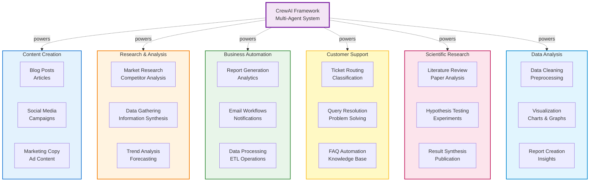
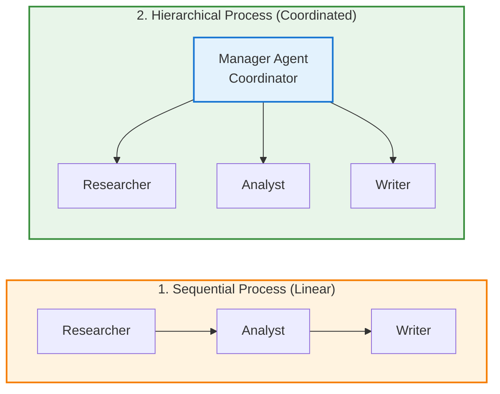
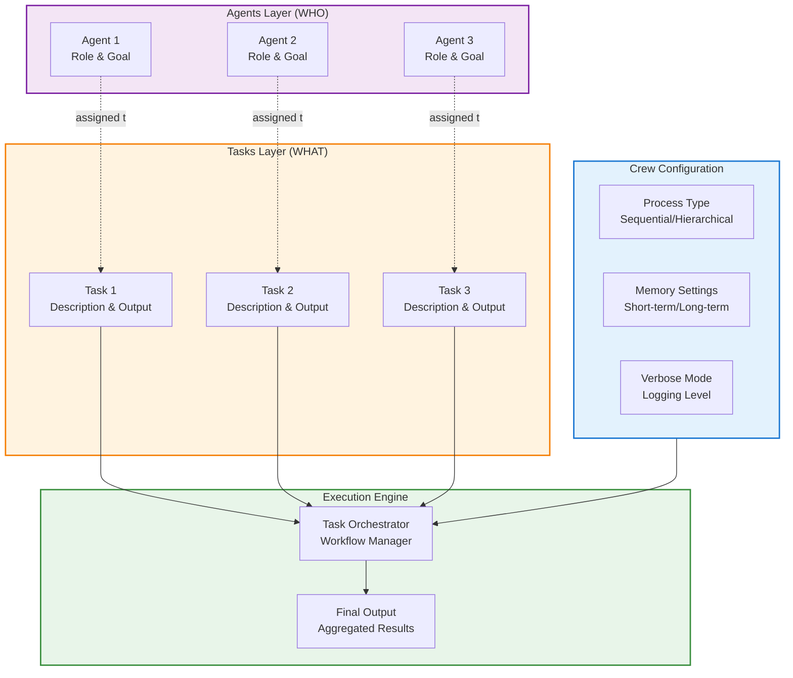
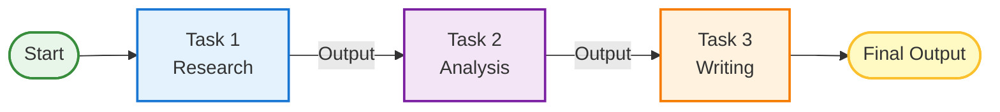
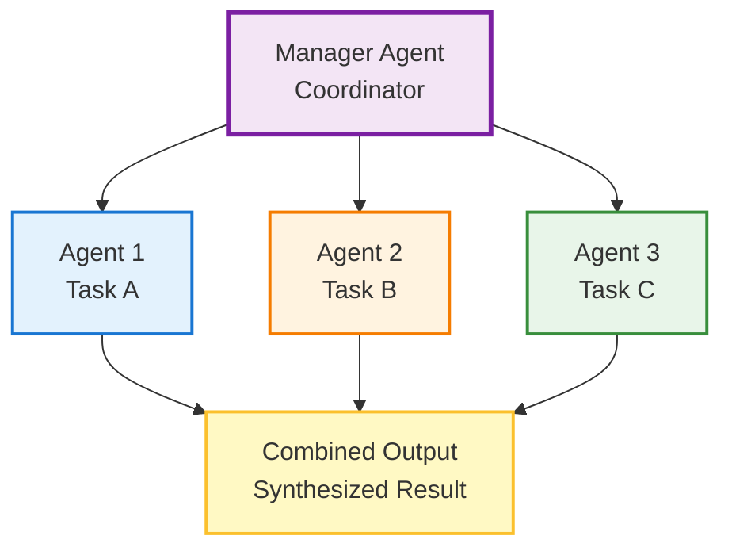
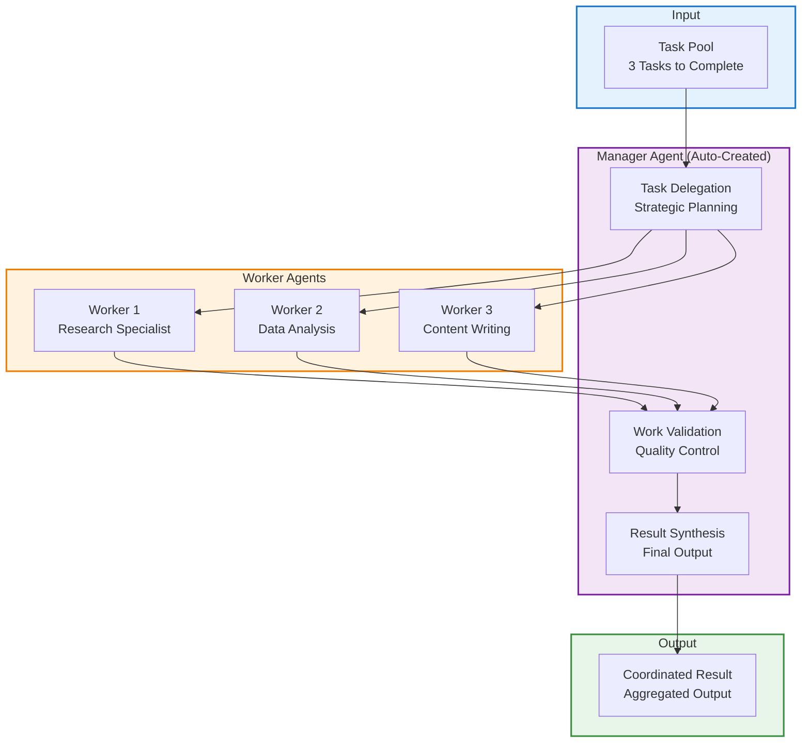
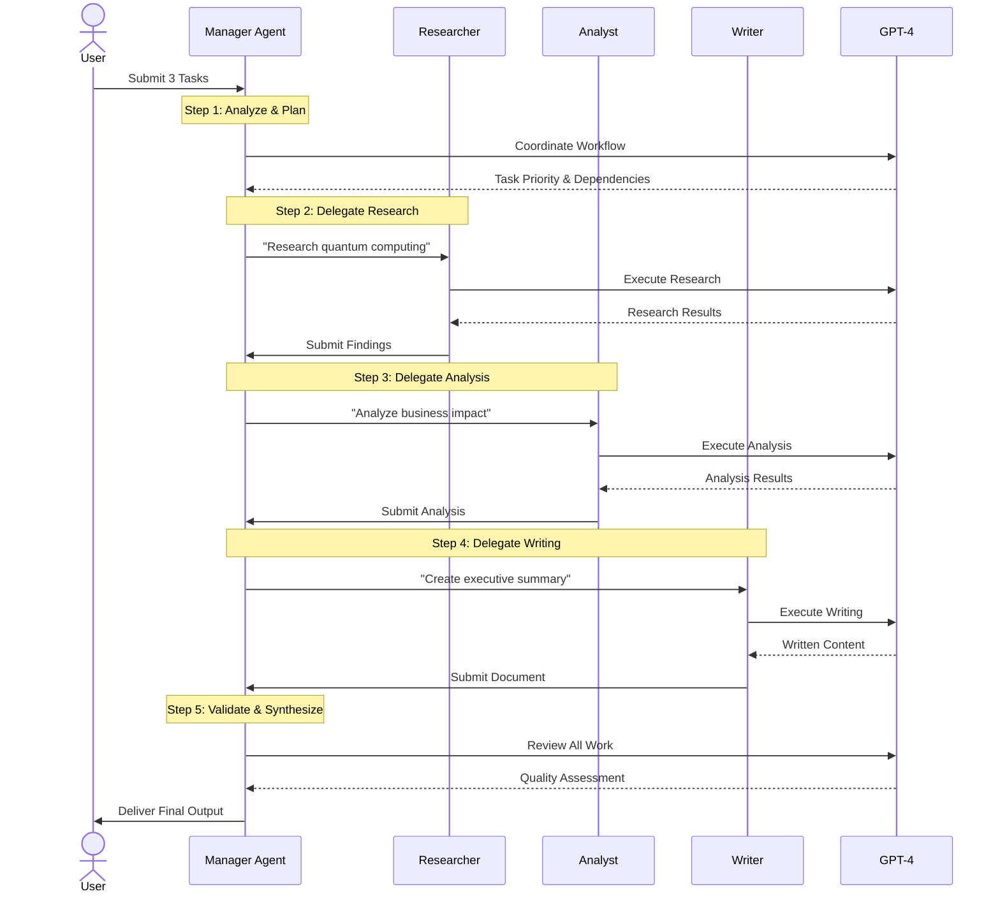
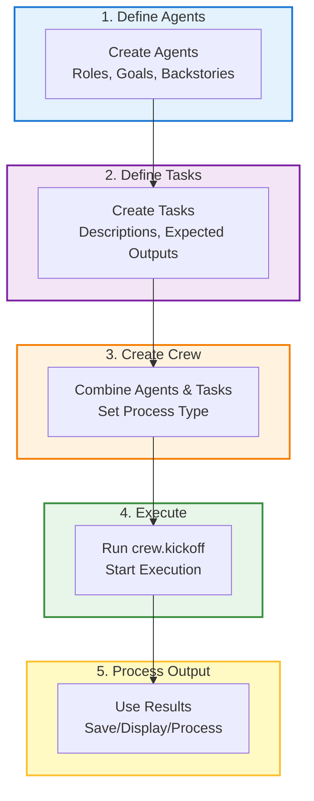
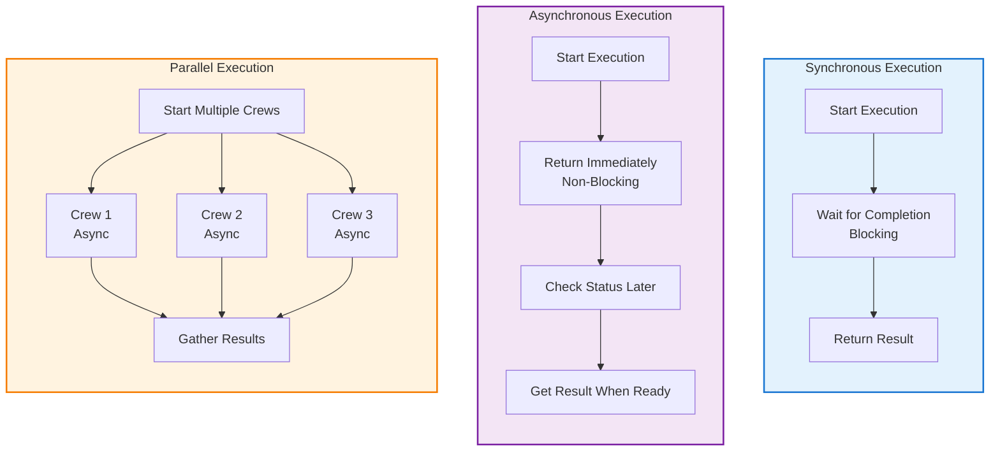
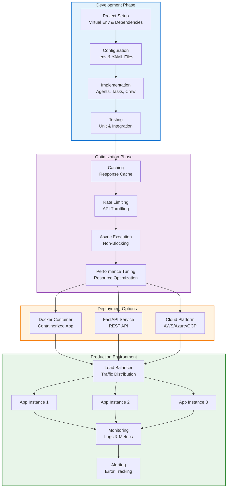

# Complete A-Z Guide to CrewAI Framework

> **The Ultimate Learning Resource for Multi-Agent AI Systems**
> 
> **Author**: Shinde Vinayak Rao Patil  
> **Last Updated**: December 7, 2025  
> **Version**: 2.0  
> **Total Sections**: 26 (A-Z) + Best Practices

---

## Table of Contents

- [Introduction](#introduction)
- [A - Agents](#a---agents)
- [B - Backstory](#b---backstory)
- [C - Crew](#c---crew)
- [D - Delegation](#d---delegation)
- [E - Environment Setup](#e---environment-setup)
- [F - Flow Control](#f---flow-control)
- [G - Goals](#g---goals)
- [H - Hierarchical Process](#h---hierarchical-process)
- [I - Installation](#i---installation)
- [J - JSON Output](#j---json-output)
- [K - Knowledge](#k---knowledge)
- [L - LLM Configuration](#l---llm-configuration)
- [M - Memory](#m---memory)
- [N - Naming Conventions](#n---naming-conventions)
- [O - Output](#o---output)
- [P - Planning](#p---planning)
- [Q - Quality Control](#q---quality-control)
- [R - Roles](#r---roles)
- [S - Sequential Process](#s---sequential-process)
- [T - Tasks](#t---tasks)
- [U - Use Cases](#u---use-cases)
- [V - Verbose Mode](#v---verbose-mode)
- [W - Workflow](#w---workflow)
- [X - eXecution](#x---execution)
- [Y - YAML Configuration](#y---yaml-configuration)
- [Z - Zero to Production](#z---zero-to-production)
- [Best Practices](#best-practices)
- [Conclusion](#conclusion)

---

## Introduction

### What is CrewAI?

**CrewAI** is a cutting-edge Python framework for orchestrating role-playing, autonomous AI agents. It enables multiple AI agents to work together as a coordinated crew, each with specific roles, goals, and tools, to accomplish complex tasks collaboratively.

Think of CrewAI as a **company structure for AI agents**: you have specialists (agents) with different roles working together towards a common goal.

### Why Use CrewAI?

1. **Role-Based Design**: Each agent has a specific expertise and responsibility
2. **Collaborative Intelligence**: Agents work together, sharing information and results
3. **Task Delegation**: Complex problems are broken down and distributed
4. **Built-in Memory**: Agents remember past interactions and learnings
5. **Tool Integration**: Easy integration with external tools and APIs
6. **Production-Ready**: Built for real-world applications with error handling

### Real-World Use Cases

<div align="center">



</div>

### CrewAI vs. Other Frameworks

| Feature | CrewAI | LangGraph | AutoGen | Phidata |
|---------|--------|-----------|---------|---------|
| **Learning Curve** | Low | Medium | Medium | Low |
| **Role-Based Agents** | Built-in | Manual | Built-in | Built-in |
| **Sequential Tasks** | Native | Via Graph | Native | Native |
| **Hierarchical Process** | Native | Complex | Native | Limited |
| **Memory System** | Advanced | Manual | Basic | Good |
| **Tool Integration** | Excellent | Excellent | Good | Excellent |
| **Production Ready** | Yes | Yes | Improving | Yes |
| **Best For** | Business workflows | Complex graphs | Chat systems | Assistants |

**Key Advantages of CrewAI:**

1. **Simplicity**: Minimal code to create complex multi-agent systems
2. **Business-Focused**: Designed for real-world business automation
3. **Role Clarity**: Clear separation of concerns through roles
4. **Task Management**: Built-in task delegation and workflow
5. **Memory**: Advanced memory systems (short-term, long-term, entity)

---

## A - Agents

### Definition

An **Agent** is an autonomous AI entity with a specific role, goal, and set of tools. Agents are the fundamental building blocks of CrewAI.

### Anatomy of an Agent

```
┌─────────────────────────────────────┐
│           AGENT STRUCTURE           │
├─────────────────────────────────────┤
│                                     │
│  ┌─────────────────────────────┐   │
│  │  Role: "What I am"          │   │
│  │  (e.g., Content Writer)     │   │
│  └─────────────────────────────┘   │
│              ↓                      │
│  ┌─────────────────────────────┐   │
│  │  Goal: "What I achieve"     │   │
│  │  (e.g., Write engaging      │   │
│  │   articles)                 │   │
│  └─────────────────────────────┘   │
│              ↓                      │
│  ┌─────────────────────────────┐   │
│  │  Backstory: "My context"    │   │
│  │  (e.g., Expert with 10yrs)  │   │
│  └─────────────────────────────┘   │
│              ↓                      │
│  ┌─────────────────────────────┐   │
│  │  Tools: "What I use"        │   │
│  │  (e.g., Web search, APIs)   │   │
│  └─────────────────────────────┘   │
│              ↓                      │
│  ┌─────────────────────────────┐   │
│  │  LLM: "My brain"            │   │
│  │  (e.g., GPT-4, Claude)      │   │
│  └─────────────────────────────┘   │
│                                     │
└─────────────────────────────────────┘
```

### Agent Properties

| Property | Required | Description | Example |
|----------|----------|-------------|---------|
| `role` | Yes | The agent's function | "Research Analyst" |
| `goal` | Yes | What the agent aims to achieve | "Find accurate market data" |
| `backstory` | Yes | Context and expertise | "Expert analyst with 10 years experience" |
| `tools` | No | List of tools agent can use | `[search_tool, calculator]` |
| `llm` | No | Language model to use | `ChatOpenAI(model="gpt-4")` |
| `verbose` | No | Print detailed logs | `True/False` |
| `allow_delegation` | No | Can delegate to other agents | `True/False` |
| `max_iter` | No | Maximum iterations | `15` |
| `memory` | No | Enable memory | `True/False` |

### Creating an Agent - Example

```python
from crewai import Agent
from langchain_openai import ChatOpenAI

# Create a research agent
researcher = Agent(
    role="Market Research Analyst",
    goal="Discover emerging trends in AI technology and provide actionable insights",
    backstory="""You are an expert market research analyst with 15 years of experience 
    in technology sector analysis. You have a keen eye for spotting trends before they 
    become mainstream and excel at synthesizing complex information into clear insights.""",
    tools=[search_tool, scrape_tool],
    llm=ChatOpenAI(model="gpt-4", temperature=0.7),
    verbose=True,
    allow_delegation=False,
    max_iter=15,
    memory=True
)
```

### Multiple Agent Types

```python
# 1. RESEARCHER - Gathers information
researcher = Agent(
    role="Research Specialist",
    goal="Gather comprehensive data on the given topic",
    backstory="Expert researcher with access to multiple data sources",
    tools=[search_tool, database_tool]
)

# 2. ANALYST - Processes information
analyst = Agent(
    role="Data Analyst",
    goal="Analyze data and extract meaningful patterns",
    backstory="Statistical expert with advanced analytical skills",
    tools=[python_tool, visualization_tool]
)

# 3. WRITER - Creates content
writer = Agent(
    role="Content Writer",
    goal="Create engaging, well-structured content",
    backstory="Professional writer with expertise in technical communication",
    tools=[grammar_tool, style_checker]
)

# 4. REVIEWER - Quality control
reviewer = Agent(
    role="Quality Reviewer",
    goal="Ensure output meets quality standards",
    backstory="Detail-oriented editor with high standards",
    tools=[fact_checker, plagiarism_tool]
)
```

### Agent Collaboration Flow

<div align="center">



</div>

---

## B - Backstory

### Definition

A **backstory** provides context, expertise, and personality to an agent. It helps the LLM understand the agent's capabilities, experience, and approach to tasks.

### Why Backstories Matter

Good backstories improve agent performance by:
1. **Setting Expertise Level**: Establishes credibility
2. **Defining Personality**: Influences response style
3. **Providing Context**: Helps make better decisions
4. **Improving Consistency**: Maintains character throughout tasks

### Backstory Best Practices

```python
# BAD: Too vague
backstory = "You are a writer."

# BAD: Too complex
backstory = """You are a writer born in 1985 in Seattle who studied at Harvard 
and worked at 15 different companies and has three cats named..."""

# GOOD: Clear, relevant, focused
backstory = """You are a senior content writer with 8 years of experience in 
technology journalism. You specialize in making complex technical concepts 
accessible to general audiences while maintaining accuracy."""

# EXCELLENT: Includes expertise, style, and approach
backstory = """You are an award-winning data scientist with a Ph.D. in Machine 
Learning and 10 years of industry experience. You excel at extracting actionable 
insights from complex datasets and presenting findings through compelling 
visualizations. Your approach is methodical, data-driven, and always focused 
on business impact."""
```

### Backstory Templates by Role

```python
# RESEARCH ROLE
research_backstory = """You are a meticulous research specialist with expertise in 
{domain}. You have {years} years of experience gathering, validating, and 
synthesizing information from diverse sources. Your strength lies in finding 
reliable data and presenting it in a structured, actionable format."""

# ANALYTICAL ROLE
analyst_backstory = """You are a senior {field} analyst with deep expertise in 
{specialty}. You have a proven track record of uncovering insights that drive 
strategic decisions. Your analytical approach combines quantitative rigor with 
qualitative understanding."""

# CREATIVE ROLE
creative_backstory = """You are a creative {profession} known for {strength}. 
With {years} years of experience, you have mastered the art of {skill}. Your 
work is characterized by {qualities} and consistently exceeds client expectations."""

# TECHNICAL ROLE
technical_backstory = """You are a senior {role} with deep technical expertise in 
{technologies}. You have architected and implemented solutions for Fortune 500 
companies and startups alike. Your code is clean, efficient, and maintainable."""
```

---

## C - Crew

### Definition

A **Crew** is a collection of agents working together to accomplish a set of tasks. It orchestrates the workflow, manages execution, and handles inter-agent communication.

### Crew Structure

<div align="center">



</div>

### Creating a Crew

```python
from crewai import Crew, Agent, Task, Process

# Step 1: Define agents
researcher = Agent(
    role="Researcher",
    goal="Find relevant information",
    backstory="Expert research specialist"
)

writer = Agent(
    role="Writer",
    goal="Create compelling content",
    backstory="Professional content writer"
)

# Step 2: Define tasks
research_task = Task(
    description="Research the latest AI trends",
    agent=researcher,
    expected_output="A comprehensive list of AI trends"
)

writing_task = Task(
    description="Write an article based on research",
    agent=writer,
    expected_output="A 500-word article",
    context=[research_task]  # Uses output from research_task
)

# Step 3: Create crew
crew = Crew(
    agents=[researcher, writer],
    tasks=[research_task, writing_task],
    process=Process.sequential,  # Execute tasks in order
    verbose=True,
    memory=True
)

# Step 4: Execute
result = crew.kickoff()
print(result)
```

### Crew Configuration Options

| Parameter | Type | Default | Description |
|-----------|------|---------|-------------|
| `agents` | List[Agent] | Required | List of agents in the crew |
| `tasks` | List[Task] | Required | List of tasks to execute |
| `process` | Process | Sequential | Execution process (Sequential/Hierarchical) |
| `verbose` | bool | False | Enable detailed logging |
| `memory` | bool | False | Enable crew memory |
| `cache` | bool | True | Cache LLM responses |
| `max_rpm` | int | None | Max requests per minute |
| `share_crew` | bool | False | Share crew data for improvement |

### Full Crew Example - Content Creation

```python
from crewai import Agent, Task, Crew, Process
from langchain_openai import ChatOpenAI

# Initialize LLM
llm = ChatOpenAI(model="gpt-4")

# Define Agents
content_planner = Agent(
    role="Content Planning Strategist",
    goal="Plan engaging content that resonates with the target audience",
    backstory="You're a content planning expert who understands audience psychology",
    llm=llm,
    verbose=True
)

content_writer = Agent(
    role="Content Writer",
    goal="Write insightful and engaging articles",
    backstory="You're a skilled writer with expertise in creating compelling narratives",
    llm=llm,
    verbose=True
)

content_editor = Agent(
    role="Content Editor",
    goal="Edit and refine content to perfection",
    backstory="You're a meticulous editor with an eye for detail and style",
    llm=llm,
    verbose=True
)

# Define Tasks
plan_task = Task(
    description="""Plan an article about {topic}. Include:
    1. Target audience
    2. Key points to cover
    3. Content structure
    4. SEO keywords""",
    agent=content_planner,
    expected_output="A detailed content plan with structure and key points"
)

write_task = Task(
    description="""Using the content plan, write a comprehensive article about {topic}.
    The article should be informative, engaging, and well-structured.""",
    agent=content_writer,
    expected_output="A complete article of 800-1000 words",
    context=[plan_task]
)

edit_task = Task(
    description="""Review and edit the article. Check for:
    1. Grammar and spelling
    2. Flow and readability
    3. Factual accuracy
    4. Engagement level""",
    agent=content_editor,
    expected_output="A polished, publication-ready article",
    context=[write_task]
)

# Create Crew
content_crew = Crew(
    agents=[content_planner, content_writer, content_editor],
    tasks=[plan_task, write_task, edit_task],
    process=Process.sequential,
    verbose=True,
    memory=True
)

# Execute
result = content_crew.kickoff(inputs={"topic": "The Future of AI in Healthcare"})
print(result)
```

---

## D - Delegation

### Definition

**Delegation** allows an agent to ask another agent for help when it encounters a task outside its expertise or needs additional information.

### When to Use Delegation

```
DELEGATION SCENARIOS
═══════════════════

USE DELEGATION WHEN:
  - Task requires specialized knowledge another agent has
  - Agent needs information it doesn't have access to
  - Complex problem benefits from multiple perspectives
  - Workload distribution improves efficiency

DON'T USE DELEGATION WHEN:
  - Sequential process works better
  - Tasks are independent
  - Over-delegation causes confusion
  - Simple tasks don't need collaboration
```

### Enabling Delegation

```python
# Enable delegation (default is True)
agent_with_delegation = Agent(
    role="Project Manager",
    goal="Coordinate project tasks",
    backstory="Experienced PM who knows when to delegate",
    allow_delegation=True  # Can ask other agents for help
)

# Disable delegation
agent_without_delegation = Agent(
    role="Independent Researcher",
    goal="Complete research independently",
    backstory="Self-sufficient researcher",
    allow_delegation=False  # Works alone
)
```

### Delegation Example

```python
from crewai import Agent, Task, Crew

# Manager agent (can delegate)
manager = Agent(
    role="Project Manager",
    goal="Ensure project completion with high quality",
    backstory="Experienced manager who coordinates teams effectively",
    allow_delegation=True,  # KEY: Enables delegation
    verbose=True
)

# Specialist agents
researcher = Agent(
    role="Technical Researcher",
    goal="Find accurate technical information",
    backstory="Expert in technical research",
    allow_delegation=False
)

developer = Agent(
    role="Software Developer",
    goal="Write clean, efficient code",
    backstory="Senior developer with 10 years experience",
    allow_delegation=False
)

# Complex task that might require delegation
complex_task = Task(
    description="""Analyze the technical feasibility of implementing a new feature.
    You may need to consult with researchers and developers.""",
    agent=manager,
    expected_output="Feasibility report with technical recommendations"
)

# The manager can delegate parts of this task to researcher and developer
crew = Crew(
    agents=[manager, researcher, developer],
    tasks=[complex_task],
    verbose=True
)
```

### Delegation Flow

```
DELEGATION WORKFLOW
══════════════════

1. Manager receives complex task
   ┌─────────────┐
   │   Manager   │
   │   "I need   │
   │   help!"    │
   └──────┬──────┘
          │
          ↓ (delegates research)
   ┌─────────────┐
   │ Researcher  │
   │ "Here's the │
   │  data"      │
   └──────┬──────┘
          │
          ↓ (returns results)
   ┌─────────────┐
   │   Manager   │
   │   "Now I    │
   │   need code"│
   └──────┬──────┘
          │
          ↓ (delegates coding)
   ┌─────────────┐
   │  Developer  │
   │ "Here's the │
   │  solution"  │
   └──────┬──────┘
          │
          ↓ (returns code)
   ┌─────────────┐
   │   Manager   │
   │  "Task      │
   │   complete!"│
   └─────────────┘
```

---

## E - Environment Setup

### Prerequisites

Before installing CrewAI, ensure you have:

1. **Python 3.10 - 3.12** (3.11 recommended)
2. **pip** (Python package manager)
3. **Virtual environment tool** (venv, conda, or virtualenv)
4. **API Keys** for LLM providers (OpenAI, Anthropic, etc.)

### System Requirements

```
Minimum Requirements:
- RAM: 4GB (8GB recommended)
- Disk Space: 2GB free
- Internet: Required for API calls
- OS: Windows, macOS, Linux
```

### Setting Up Your Environment

```bash
# 1. Check Python version
python --version  # Should be 3.10 - 3.12

# 2. Create project directory
mkdir my_crewai_project
cd my_crewai_project

# 3. Create virtual environment
python -m venv venv

# 4. Activate virtual environment
# On Windows:
venv\Scripts\activate
# On macOS/Linux:
source venv/bin/activate

# 5. Upgrade pip
pip install --upgrade pip

# 6. Install CrewAI
pip install crewai
pip install 'crewai[tools]'  # With additional tools

# 7. Install LLM provider
pip install langchain-openai  # For OpenAI
# OR
pip install langchain-anthropic  # For Claude
```

### Environment Variables

Create a `.env` file in your project root:

```bash
# .env file
OPENAI_API_KEY=your_openai_key_here
ANTHROPIC_API_KEY=your_anthropic_key_here
SERPER_API_KEY=your_serper_key_here  # For web search

# Optional settings
CREWAI_VERBOSE=True
CREWAI_MEMORY=True
```

### Loading Environment Variables

```python
# Load environment variables
import os
from dotenv import load_dotenv

load_dotenv()

# Access variables
openai_key = os.getenv("OPENAI_API_KEY")
```

### Project Structure

```
my_crewai_project/
│
├── venv/                   # Virtual environment
│
├── .env                    # Environment variables (DON'T COMMIT!)
├── .gitignore             # Git ignore file
│
├── src/
│   ├── __init__.py
│   ├── agents.py          # Agent definitions
│   ├── tasks.py           # Task definitions
│   ├── tools.py           # Custom tools
│   └── crew.py            # Crew configuration
│
├── config/
│   ├── agents.yaml        # Agent configurations (optional)
│   └── tasks.yaml         # Task configurations (optional)
│
├── main.py                # Entry point
├── requirements.txt       # Dependencies
└── README.md             # Documentation
```

### requirements.txt

```txt
crewai==0.28.0
crewai-tools==0.2.0
langchain-openai==0.1.0
python-dotenv==1.0.0
```

### .gitignore

```txt
# Environment
venv/
.env

# Python
__pycache__/
*.pyc
*.pyo
*.pyd
.Python

# IDE
.vscode/
.idea/
*.swp

# Logs
*.log
```

---

## F - Flow Control

### Process Types

CrewAI supports two main process types:

1. **Sequential Process**: Tasks execute one after another
2. **Hierarchical Process**: A manager agent coordinates task distribution

### Sequential Process

<div align="center">



</div>

```python
from crewai import Crew, Process

crew = Crew(
    agents=[agent1, agent2, agent3],
    tasks=[task1, task2, task3],
    process=Process.sequential  # Tasks execute in order
)
```

### Hierarchical Process

<div align="center">



</div>

```python
from crewai import Crew, Process

# Manager agent is automatically created
crew = Crew(
    agents=[agent1, agent2, agent3],
    tasks=[task1, task2, task3],
    process=Process.hierarchical,  # Manager coordinates
    manager_llm=ChatOpenAI(model="gpt-4")  # LLM for manager
)
```

### Task Context

Tasks can use outputs from previous tasks:

```python
# Task 1 output becomes input for Task 2
task1 = Task(
    description="Research AI trends",
    agent=researcher,
    expected_output="List of trends"
)

task2 = Task(
    description="Analyze the trends from research",
    agent=analyst,
    expected_output="Analysis report",
    context=[task1]  # Uses task1 output
)

task3 = Task(
    description="Write article based on analysis",
    agent=writer,
    expected_output="Published article",
    context=[task1, task2]  # Uses both outputs
)
```

### Conditional Flow (Custom Logic)

```python
# You can add custom logic between crew executions
def smart_workflow(topic):
    # First crew: Research
    research_result = research_crew.kickoff(inputs={"topic": topic})
    
    # Conditional logic
    if "insufficient data" in research_result.lower():
        # Run additional research
        deep_research_result = deep_research_crew.kickoff(
            inputs={"topic": topic}
        )
        data = deep_research_result
    else:
        data = research_result
    
    # Second crew: Analysis
    analysis_result = analysis_crew.kickoff(inputs={"data": data})
    
    return analysis_result
```

---

## G - Goals

### Definition

A **goal** defines what an agent aims to achieve. It's the agent's primary objective and guides all its actions and decisions.

### Writing Effective Goals

```
GOAL FORMULA
════════════

[Action Verb] + [What] + [Quality/Constraint]

Examples:
"Discover emerging AI trends and provide actionable insights"
"Write comprehensive technical documentation that developers can follow"
"Analyze financial data and identify cost-saving opportunities"
```

### Good vs. Bad Goals

```python
# BAD GOALS

# Too vague
goal = "Help with tasks"

# No clear outcome
goal = "Work on the project"

# Too narrow
goal = "Search Google"

# GOOD GOALS

# Clear action and outcome
goal = "Research and compile a comprehensive list of AI tools released in 2024"

# Specific with quality standard
goal = "Write engaging blog posts that educate readers and drive engagement"

# Measurable objective
goal = "Analyze sales data to identify the top 5 product improvement opportunities"

# EXCELLENT GOALS

# Action + What + Quality + Constraint
goal = """Conduct thorough market research on competitors' pricing strategies 
and deliver a detailed report with actionable recommendations within the 
technology sector"""

# Clear success criteria
goal = """Create SEO-optimized content that ranks in top 10 search results 
while maintaining readability and engagement for non-technical audiences"""
```

### Goals by Agent Type

```python
# RESEARCHER
goal = """Gather comprehensive, verified information from reliable sources 
and organize it into actionable intelligence"""

# ANALYST
goal = """Analyze data to uncover meaningful patterns, trends, and insights 
that drive strategic decision-making"""

# WRITER
goal = """Create compelling, well-researched content that engages readers 
and effectively communicates complex ideas"""

# DEVELOPER
goal = """Design and implement efficient, maintainable code solutions that 
meet technical requirements and best practices"""

# REVIEWER/QA
goal = """Ensure deliverables meet quality standards through thorough review, 
testing, and validation"""

# STRATEGIST
goal = """Develop data-driven strategies that align with business objectives 
and maximize return on investment"""
```

### Aligning Goals with Tasks

```python
# Agent goal defines overall purpose
agent = Agent(
    role="Market Analyst",
    goal="Provide market intelligence that informs strategic business decisions",
    backstory="..."
)

# Tasks should align with agent's goal
task1 = Task(
    description="Analyze Q3 sales data for the North American market",
    agent=agent,
    expected_output="Sales analysis report with trends and recommendations"
)

task2 = Task(
    description="Identify top 3 competitor strategies in the market",
    agent=agent,
    expected_output="Competitive intelligence brief"
)

# Both tasks support the agent's goal of providing market intelligence
```

---

## H - Hierarchical Process

### Definition

In a **hierarchical process**, a manager agent coordinates and delegates tasks to other agents, similar to a project manager leading a team.

### Hierarchical Architecture

<div align="center">



</div>

### Hierarchical Execution Flow

<div align="center">



</div>

### When to Use Hierarchical Process

```
USE HIERARCHICAL WHEN:
 - Complex projects need coordination
 - Parallel task execution needed
 - Dynamic task allocation required
 - Quality oversight is critical
 - Tasks have dependencies

USE SEQUENTIAL WHEN:
 - Linear workflow is natural
 - Each step builds on previous
 - Simple task chain
 - No need for coordination overhead
```

### Implementing Hierarchical Process

```python
from crewai import Agent, Task, Crew, Process
from langchain_openai import ChatOpenAI

# Define worker agents (NO MANAGER NEEDED - it's auto-created)
researcher = Agent(
    role="Research Specialist",
    goal="Gather comprehensive information on assigned topics",
    backstory="Expert researcher with access to multiple sources",
    verbose=True
)

analyst = Agent(
    role="Data Analyst",
    goal="Analyze data and extract meaningful insights",
    backstory="Analytical expert with statistical background",
    verbose=True
)

writer = Agent(
    role="Technical Writer",
    goal="Create clear, engaging documentation",
    backstory="Experienced technical communicator",
    verbose=True
)

# Define tasks (Manager will delegate these)
research_task = Task(
    description="Research the latest developments in quantum computing",
    expected_output="Comprehensive research report with key findings",
    agent=researcher
)

analysis_task = Task(
    description="Analyze the research findings for business implications",
    expected_output="Business impact analysis",
    agent=analyst
)

writing_task = Task(
    description="Create an executive summary of findings and recommendations",
    expected_output="Executive summary document",
    agent=writer
)

# Create hierarchical crew
# Manager agent is automatically created and will coordinate
hierarchical_crew = Crew(
    agents=[researcher, analyst, writer],
    tasks=[research_task, analysis_task, writing_task],
    process=Process.hierarchical,  # KEY: Enables hierarchical mode
    manager_llm=ChatOpenAI(model="gpt-4", temperature=0.3),  # Manager's brain
    verbose=True,
    memory=True
)

# Execute - Manager coordinates everything
result = hierarchical_crew.kickoff()
```

### Hierarchical Flow Example

```
EXECUTION FLOW
══════════════

Step 1: Manager receives tasks
  ┌─────────────────────────────┐
  │ Manager: "I have 3 tasks    │
  │ to coordinate"              │
  └─────────────────────────────┘

Step 2: Manager analyzes and plans
  ┌─────────────────────────────┐
  │ Manager: "Research first,   │
  │ then analysis, then writing"│
  └─────────────────────────────┘

Step 3: Manager delegates
  ┌─────────────────────────────┐
  │ Manager → Researcher:       │
  │ "Start research on quantum" │
  └─────────────────────────────┘
           ↓
  ┌─────────────────────────────┐
  │ Researcher completes work   │
  └─────────────────────────────┘
           ↓
  ┌─────────────────────────────┐
  │ Manager validates output    │
  └─────────────────────────────┘
           ↓
  ┌─────────────────────────────┐
  │ Manager → Analyst:          │
  │ "Analyze these findings"    │
  └─────────────────────────────┘
           ↓
  (Process continues...)
```

### Manager Agent Capabilities

The auto-created manager agent:

1. **Task Planning**: Determines optimal task execution order
2. **Delegation**: Assigns tasks to appropriate agents
3. **Quality Control**: Validates agent outputs
4. **Coordination**: Manages dependencies between tasks
5. **Synthesis**: Combines results into final output

### Hierarchical vs Sequential Comparison

```python
# SEQUENTIAL - Linear execution
sequential_crew = Crew(
    agents=[agent1, agent2, agent3],
    tasks=[task1, task2, task3],
    process=Process.sequential  # task1 → task2 → task3
)

# HIERARCHICAL - Managed execution
hierarchical_crew = Crew(
    agents=[agent1, agent2, agent3],
    tasks=[task1, task2, task3],
    process=Process.hierarchical,  # Manager coordinates
    manager_llm=ChatOpenAI(model="gpt-4")
)
```

| Aspect | Sequential | Hierarchical |
|--------|-----------|--------------|
| Coordination | None | Manager agent |
| Execution | Linear order | Manager decides |
| Parallelization | No | Possible |
| Complexity | Simple | Higher |
| Best for | Simple workflows | Complex projects |
| Overhead | Low | Higher (manager) |

---

## I - Installation

### Step-by-Step Installation Guide

#### 1. Python Installation

```bash
# Check if Python is installed
python --version

# If not installed:
# Visit https://www.python.org/downloads/
# Download Python 3.10, 3.11, or 3.12 (3.11 recommended)
```

#### 2. Create Project Directory

```bash
# Create your project folder
mkdir my_crewai_app
cd my_crewai_app
```

#### 3. Create Virtual Environment

```bash
# Using venv (built-in)
python -m venv venv

# Using conda (if you have Anaconda)
conda create -n crewai-env python=3.11
conda activate crewai-env
```

#### 4. Activate Virtual Environment

```bash
# Windows
venv\Scripts\activate

# macOS/Linux
source venv/bin/activate

# You should see (venv) in your terminal prompt
```

#### 5. Install CrewAI

```bash
# Upgrade pip first
pip install --upgrade pip

# Install CrewAI (core)
pip install crewai

# Install CrewAI with tools (recommended)
pip install 'crewai[tools]'

# Install specific version
pip install crewai==0.28.0
```

#### 6. Install LLM Providers

```bash
# OpenAI (most common)
pip install langchain-openai

# Anthropic (Claude)
pip install langchain-anthropic

# Google (Gemini)
pip install langchain-google-genai

# Groq (fast inference)
pip install langchain-groq

# Ollama (local models)
pip install langchain-ollama
```

#### 7. Install Additional Tools

```bash
# Web tools
pip install google-search-results  # For Serper
pip install requests beautifulsoup4  # For web scraping

# Data tools
pip install pandas numpy  # For data manipulation

# Utilities
pip install python-dotenv  # For environment variables
```

#### 8. Verify Installation

```bash
# Check CrewAI version
pip show crewai

# Test import
python -c "from crewai import Agent, Task, Crew; print('CrewAI installed successfully!')"
```

### Quick Install Script

Create `install.sh` (macOS/Linux) or `install.bat` (Windows):

```bash
#!/bin/bash
# install.sh

echo "Setting up CrewAI environment..."

# Create and activate virtual environment
python3 -m venv venv
source venv/bin/activate

# Upgrade pip
pip install --upgrade pip

# Install CrewAI with tools
pip install 'crewai[tools]'
pip install langchain-openai
pip install python-dotenv

# Create project structure
mkdir -p src config
touch .env .gitignore
touch src/__init__.py src/agents.py src/tasks.py src/crew.py
touch main.py requirements.txt

echo "Setup complete! Activate environment with: source venv/bin/activate"
```

### Troubleshooting

```
COMMON ISSUES AND SOLUTIONS
═══════════════════════════

Issue: "pip: command not found"
Solution: Ensure Python is installed and added to PATH

Issue: "Permission denied"
Solution: Use --user flag: pip install --user crewai

Issue: "Module not found" after install
Solution: Ensure virtual environment is activated

Issue: "SSL Certificate error"
Solution: pip install --trusted-host pypi.org crewai

Issue: Version conflicts
Solution: Create fresh virtual environment
```

### Verifying Your Setup

Create `test_setup.py`:

```python
"""
Test if CrewAI is properly installed
Run: python test_setup.py
"""

def test_imports():
    """Test all necessary imports"""
    try:
        from crewai import Agent, Task, Crew, Process
        from langchain_openai import ChatOpenAI
        print("All imports successful!")
        return True
    except ImportError as e:
        print(f"Import error: {e}")
        return False

def test_agent_creation():
    """Test creating a basic agent"""
    try:
        from crewai import Agent
        agent = Agent(
            role="Test Agent",
            goal="Test goal",
            backstory="Test backstory"
        )
        print("Agent creation successful!")
        return True
    except Exception as e:
        print(f"Agent creation error: {e}")
        return False

def test_environment():
    """Test environment variables"""
    import os
    from dotenv import load_dotenv
    
    load_dotenv()
    
    if os.getenv("OPENAI_API_KEY"):
        print("Environment variables loaded!")
        return True
    else:
        print("No API keys found in .env file")
        return False

if __name__ == "__main__":
    print("Testing CrewAI Setup...\n")
    test_imports()
    test_agent_creation()
    test_environment()
    print("\nSetup test complete!")
```

---

## J - JSON Output

### Structured Output

CrewAI can return structured JSON output for easy integration with other systems.

### Defining Output Format

```python
from crewai import Task
from pydantic import BaseModel

# Define your output structure using Pydantic
class ResearchOutput(BaseModel):
    title: str
    summary: str
    key_findings: list[str]
    sources: list[str]
    confidence_score: float

# Create task with JSON output
research_task = Task(
    description="Research AI trends",
    agent=researcher,
    expected_output="Structured research report",
    output_json=ResearchOutput  # Enforces JSON structure
)
```

### Complex JSON Example

```python
from pydantic import BaseModel, Field
from typing import List, Optional

# Define nested structure
class Competitor(BaseModel):
    name: str
    market_share: float
    strengths: List[str]
    weaknesses: List[str]

class MarketAnalysis(BaseModel):
    market_size: float = Field(description="Market size in millions")
    growth_rate: float = Field(description="Annual growth rate as percentage")
    competitors: List[Competitor]
    opportunities: List[str]
    threats: List[str]
    recommendation: str

# Use in task
analysis_task = Task(
    description="Analyze the smartphone market",
    agent=analyst,
    expected_output="Complete market analysis",
    output_json=MarketAnalysis
)

# Execute and get structured output
result = crew.kickoff()
print(result.json())  # Valid JSON output
```

### Output Validation

```python
from pydantic import BaseModel, validator

class ProductReview(BaseModel):
    product_name: str
    rating: float
    pros: List[str]
    cons: List[str]
    recommendation: bool
    
    @validator('rating')
    def rating_must_be_valid(cls, v):
        if not 0 <= v <= 5:
            raise ValueError('Rating must be between 0 and 5')
        return v
    
    @validator('pros', 'cons')
    def lists_must_not_be_empty(cls, v):
        if len(v) < 1:
            raise ValueError('Must have at least one item')
        return v

review_task = Task(
    description="Review the product",
    agent=reviewer,
    expected_output="Product review",
    output_json=ProductReview  # Validates output
)
```

### Converting to Different Formats

```python
import json
import csv

# Execute crew
result = crew.kickoff()

# Convert to JSON file
with open('output.json', 'w') as f:
    json.dump(result.json(), f, indent=2)

# Convert to CSV (if output is a list)
if isinstance(result, list):
    with open('output.csv', 'w', newline='') as f:
        writer = csv.DictWriter(f, fieldnames=result[0].keys())
        writer.writeheader()
        writer.writerows(result)

# Convert to formatted text
formatted_output = json.dumps(result.json(), indent=2)
print(formatted_output)
```

---

## K - Knowledge

### Knowledge Sources

CrewAI agents can access knowledge from multiple sources:

1. **Built-in Knowledge**: From the LLM's training data
2. **Tools**: External APIs and services
3. **Memory**: From previous interactions
4. **Context**: From previous task outputs
5. **Custom Knowledge Bases**: Documents and databases

### Tool-Based Knowledge

```python
from crewai_tools import SerperDevTool, ScrapeWebsiteTool

# Search tool for web knowledge
search_tool = SerperDevTool()

# Web scraping tool
scrape_tool = ScrapeWebsiteTool()

# Agent with knowledge tools
knowledgeable_agent = Agent(
    role="Research Expert",
    goal="Gather comprehensive information",
    backstory="Expert with access to multiple knowledge sources",
    tools=[search_tool, scrape_tool],  # Knowledge access
    verbose=True
)
```

### Custom Knowledge Base

```python
from crewai_tools import FileReadTool, DirectoryReadTool

# Read from specific files
file_tool = FileReadTool(file_path='./knowledge/documentation.pdf')

# Read from directories
directory_tool = DirectoryReadTool(directory='./knowledge_base')

# Agent with custom knowledge
agent = Agent(
    role="Documentation Expert",
    goal="Answer questions using company documentation",
    backstory="Expert with access to internal knowledge base",
    tools=[file_tool, directory_tool]
)
```

### Knowledge Integration Example

```python
from crewai import Agent, Task, Crew
from crewai_tools import SerperDevTool, FileReadTool

# Knowledge tools
search = SerperDevTool()
docs = FileReadTool(file_path='./company_docs.pdf')

# Agent that combines multiple knowledge sources
researcher = Agent(
    role="Senior Researcher",
    goal="Provide comprehensive, accurate information",
    backstory="""Expert researcher who combines web knowledge with 
    internal documentation to provide complete answers""",
    tools=[search, docs],  # Multiple knowledge sources
    verbose=True
)

# Task that requires diverse knowledge
research_task = Task(
    description="""Research our product's competitive advantages.
    Use both web search for market info and internal docs for product details.""",
    agent=researcher,
    expected_output="Competitive analysis report"
)

crew = Crew(
    agents=[researcher],
    tasks=[research_task],
    verbose=True
)

result = crew.kickoff()
```

---

L - LLM Configuration
Supported LLMs
CrewAI supports multiple LLM providers:
SUPPORTED LLM PROVIDERS
════════════════════════

1. OpenAI (GPT-4, GPT-3.5)
2. Anthropic (Claude 3)
3. Google (Gemini)
4. Groq (Fast inference)
5. Ollama (Local models)
6. Azure OpenAI
7. Cohere
8. Hugging Face
Configuring Different LLMs
OpenAI
pythonfrom langchain_openai import ChatOpenAI

# GPT-4
gpt4 = ChatOpenAI(
    model="gpt-4",
    temperature=0.7,
    max_tokens=2000
)

# GPT-3.5 Turbo (faster, cheaper)
gpt35 = ChatOpenAI(
    model="gpt-3.5-turbo",
    temperature=0.5
)

# Use in agent
agent = Agent(
    role="Writer",
    goal="Write content",
    backstory="Professional writer",
    llm=gpt4  # Specify LLM
)
Anthropic (Claude)
pythonfrom langchain_anthropic import ChatAnthropic

# Claude 3 Opus (most capable)
claude_opus = ChatAnthropic(
    model="claude-3-opus-20240229",
    temperature=0.7,
    max_tokens=4096
)

# Claude 3 Sonnet (balanced)
claude_sonnet = ChatAnthropic(
    model="claude-3-sonnet-20240229",
    temperature=0.5
)

agent = Agent(
    role="Analyst",
    goal="Analyze data",
    backstory="Expert analyst",
    llm=claude_sonnet
)
Google Gemini
pythonfrom langchain_google_genai import ChatGoogleGenerativeAI

# Gemini Pro
gemini = ChatGoogleGenerativeAI(
    model="gemini-pro",
    temperature=0.7,
    google_api_key=os.getenv("GOOGLE_API_KEY")
)

agent = Agent(
    role="Researcher",
    goal="Research topics",
    backstory="Expert researcher",
    llm=gemini
)
Ollama (Local Models)
pythonfrom langchain_ollama import ChatOllama

# Run models locally (requires Ollama installed)
llama = ChatOllama(
    model="llama2",
    temperature=0.7
)

# Free, private, no API costs
agent = Agent(
    role="Assistant",
    goal="Help with tasks",
    backstory="Helpful assistant",
    llm=llama
)
LLM Configuration Options
pythonfrom langchain_openai import ChatOpenAI

llm = ChatOpenAI(
    model="gpt-4",              # Model name
    temperature=0.7,            # Creativity (0-2)
    max_tokens=2000,            # Max response length
    top_p=1.0,                  # Nucleus sampling
    frequency_penalty=0.0,      # Reduce repetition
    presence_penalty=0.0,       # Encourage new topics
    request_timeout=120,        # Timeout in seconds
    max_retries=2               # Retry failed requests
)
Temperature Guide
TEMPERATURE SETTINGS
════════════════════

0.0 - 0.3: Deterministic, factual
├─ Best for: Analysis, code, facts
├─ Output: Consistent, focused
└─ Example: "2+2=4"

0.4 - 0.7: Balanced
├─ Best for: General tasks, writing
├─ Output: Varied but reasonable
└─ Example: "Let's explore options..."

0.8 - 1.0: Creative
├─ Best for: Brainstorming, stories
├─ Output: Diverse, creative
└─ Example: "Imagine a world where..."

1.1 - 2.0: Very creative (use cautiously)
├─ Best for: Artistic content
├─ Output: Highly unpredictable
└─ Example: Random, wild ideas
Using Different LLMs for Different Agents
pythonfrom langchain_openai import ChatOpenAI
from langchain_anthropic import ChatAnthropic

# Precise LLM for analysis
precise_llm = ChatOpenAI(model="gpt-4", temperature=0.2)

# Creative LLM for writing
creative_llm = ChatAnthropic(model="claude-3-opus-20240229", temperature=0.9)

# Analyst needs precision
analyst = Agent(
    role="Data Analyst",
    goal="Provide accurate analysis",
    backstory="Precise analytical expert",
    llm=precise_llm  # Low temperature
)

# Writer needs creativity
writer = Agent(
    role="Creative Writer",
    goal="Write engaging content",
    backstory="Creative content specialist",
    llm=creative_llm  # High temperature
)

crew = Crew(
    agents=[analyst, writer],
    tasks=[analysis_task, writing_task],
    verbose=True
)

M - Memory
Memory Types
CrewAI provides three types of memory:
MEMORY TYPES
════════════

1. SHORT-TERM MEMORY
   ├─ Scope: Current execution
   ├─ Duration: Single crew run
   └─ Use: Task outputs, immediate context

2. LONG-TERM MEMORY
   ├─ Scope: Across executions
   ├─ Duration: Persistent
   └─ Use: Learnings, patterns, history

3. ENTITY MEMORY
   ├─ Scope: Entities (people, places, things)
   ├─ Duration: Persistent
   └─ Use: Facts about entities
Enabling Memory
pythonfrom crewai import Crew, Agent, Task

# Enable memory in crew
crew = Crew(
    agents=[agent1, agent2],
    tasks=[task1, task2],
    memory=True,  # Enables all memory types
    verbose=True
)
Memory Architecture
MEMORY FLOW
═══════════

         ┌──────────────────────┐
         │   CREW EXECUTION     │
         └──────────┬───────────┘
                    │
         ┌──────────▼───────────┐
         │  SHORT-TERM MEMORY   │
         │  (Current session)   │
         └──────────┬───────────┘
                    │
         ┌──────────▼───────────┐
         │  LONG-TERM MEMORY    │
         │  (Stored for future) │
         └──────────┬───────────┘
                    │
         ┌──────────▼───────────┐
         │   ENTITY MEMORY      │
         │  (Facts about things)│
         └──────────────────────┘
                    │
         ┌──────────▼───────────┐
         │  FUTURE EXECUTIONS   │
         │  (Improved over time)│
         └──────────────────────┘
Memory Usage Example
pythonfrom crewai import Agent, Task, Crew

# Agents with memory
researcher = Agent(
    role="Researcher",
    goal="Research topics thoroughly",
    backstory="Expert researcher",
    memory=True,  # Agent-level memory
    verbose=True
)

writer = Agent(
    role="Writer",
    goal="Write based on research",
    backstory="Professional writer",
    memory=True,
    verbose=True
)

# Tasks
research_task = Task(
    description="Research artificial intelligence trends",
    agent=researcher,
    expected_output="Research report"
)

writing_task = Task(
    description="Write an article based on research",
    agent=writer,
    expected_output="Article",
    context=[research_task]
)

# Crew with memory enabled
memory_crew = Crew(
    agents=[researcher, writer],
    tasks=[research_task, writing_task],
    memory=True,  # Crew-level memory
    verbose=True
)

# First execution - learns patterns
result1 = memory_crew.kickoff()

# Second execution - uses previous learnings
result2 = memory_crew.kickoff()  # Improved based on memory
Memory Benefits
MEMORY ADVANTAGES
═════════════════

CONSISTENCY
    Agents remember past decisions and maintain consistency

EFFICIENCY
    Don't repeat research or analysis already done

LEARNING
    Improve performance over time

CONTEXT AWARENESS
    Understand relationships and patterns

PERSONALIZATION
    Adapt to specific use cases and preferences
Memory Configuration
python# Detailed memory configuration
crew = Crew(
    agents=[agent1, agent2],
    tasks=[task1, task2],
    memory=True,
    cache=True,  # Cache LLM responses
    verbose=True
)

# Memory is automatically managed
# - Short-term: Cleared after execution
# - Long-term: Persisted to storage
# - Entity: Extracted and stored automatically

N - Naming Conventions
Best Practices for Naming
NAMING GUIDELINES
═════════════════

DO:
    - Use descriptive names
    - Be consistent
    - Use snake_case for variables
    - Use PascalCase for classes
    - Make names self-explanatory

DON'T:
    - Use single letters (except loops)
    - Be overly verbose
    - Use abbreviations
    - Mix naming styles
Agent Naming
python# BAD
agent1 = Agent(role="Writer", goal="Write", backstory="Writer")
a = Agent(role="Researcher", goal="Research", backstory="Researcher")

# GOOD
content_writer = Agent(
    role="Content Writer",
    goal="Create engaging articles",
    backstory="Professional content creator"
)

market_researcher = Agent(
    role="Market Research Specialist",
    goal="Gather market intelligence",
    backstory="Expert market analyst"
)

# EXCELLENT - Clear purpose from name
senior_technical_writer = Agent(
    role="Senior Technical Writer",
    goal="Create comprehensive technical documentation",
    backstory="10+ years experience in technical writing"
)
Task Naming
python# BAD
t1 = Task(description="Do research", agent=agent1)
task = Task(description="Write something", agent=agent2)

# GOOD
research_task = Task(
    description="Research AI trends",
    agent=researcher,
    expected_output="Research report"
)

writing_task = Task(
    description="Write article on AI",
    agent=writer,
    expected_output="Published article"
)

# EXCELLENT - Descriptive and specific
market_analysis_task = Task(
    description="Analyze competitive landscape in AI market",
    agent=market_analyst,
    expected_output="Comprehensive market analysis with recommendations"
)
Crew Naming
python# BAD
crew = Crew(agents=[a1, a2], tasks=[t1, t2])
my_crew = Crew(agents=agents, tasks=tasks)

# GOOD
content_crew = Crew(
    agents=[researcher, writer],
    tasks=[research_task, writing_task]
)

# EXCELLENT - Describes purpose
content_creation_pipeline = Crew(
    agents=[researcher, analyst, writer, editor],
    tasks=[research, analysis, writing, editing],
    process=Process.sequential
)
File Naming
PROJECT STRUCTURE
═════════════════

GOOD STRUCTURE:
my_project/
├── agents/
│   ├── content_agents.py      # Content-related agents
│   ├── research_agents.py     # Research agents
│   └── analysis_agents.py     # Analysis agents
├── tasks/
│   ├── content_tasks.py
│   └── research_tasks.py
├── crews/
│   └── content_crew.py
└── main.py

BAD STRUCTURE:
my_project/
├── stuff.py
├── agent1.py
├── file.py
└── temp.py

O - Output
Output Types
CrewAI tasks can produce different output types:
OUTPUT TYPES
════════════

1. TEXT OUTPUT (default)
   └─ Simple string response

2. JSON OUTPUT
   └─ Structured data (Pydantic models)

3. FILE OUTPUT
   └─ Save to file system

4. CUSTOM OUTPUT
   └─ Process with callback
Text Output (Default)
pythontask = Task(
    description="Write a summary of AI trends",
    agent=writer,
    expected_output="A 200-word summary"
)

result = crew.kickoff()
print(result)  # String output
Structured JSON Output
pythonfrom pydantic import BaseModel
from typing import List

class ArticleOutput(BaseModel):
    title: str
    content: str
    tags: List[str]
    word_count: int

task = Task(
    description="Write an article about AI",
    agent=writer,
    expected_output="Complete article with metadata",
    output_json=ArticleOutput  # Structured output
)

result = crew.kickoff()
# result is an ArticleOutput object
print(result.title)
print(result.content)
print(result.tags)
File Output
pythontask = Task(
    description="Create a report",
    agent=analyst,
    expected_output="Comprehensive report",
    output_file="report.txt"  # Save to file
)

crew.kickoff()
# Output automatically saved to report.txt
Multiple Outputs
pythonfrom pydantic import BaseModel

class ResearchOutput(BaseModel):
    summary: str
    sources: List[str]
    key_findings: List[str]

# Task with both file and JSON output
research_task = Task(
    description="Research the topic",
    agent=researcher,
    expected_output="Research findings",
    output_file="research_results.json",  # Save to file
    output_json=ResearchOutput  # Structured format
)
Accessing Output
python# Execute crew
result = crew.kickoff()

# Access final output
print("Final Result:", result)

# Access task-specific outputs
for task_output in crew.tasks_output:
    print(f"Task: {task_output.description}")
    print(f"Output: {task_output.output}")
    print(f"Agent: {task_output.agent}")
Output Processing
python# Custom output processing
def process_output(output):
    """Process crew output"""
    # Clean the output
    cleaned = output.strip()
    
    # Validate
    if len(cleaned) < 100:
        raise ValueError("Output too short")
    
    # Format
    formatted = f"=== RESULT ===\n{cleaned}\n============="
    
    return formatted

# Execute and process
result = crew.kickoff()
final_output = process_output(result)
print(final_output)

P - Planning
What is Planning?
Planning allows agents to create a step-by-step plan before executing tasks, improving task breakdown and execution strategy.
Planning Architecture
PLANNING FLOW
═════════════

Without Planning:
┌──────────┐
│   Task   │ → Direct Execution → Result
└──────────┘

With Planning:
┌──────────┐
│   Task   │
└────┬─────┘
     ↓
┌────────────┐
│  Planning  │
│  Phase     │
│ 1. Analyze │
│ 2. Break   │
│ 3. Order   │
└────┬───────┘
     ↓
┌────────────┐
│ Execution  │
│  Phase     │
│ Step 1 → 2 │
│ Step 2 → 3 │
│ Step 3 →..│
└────┬───────┘
     ↓
  Result
Enabling Planning
pythonfrom crewai import Crew, Agent, Task

# Enable planning in crew
crew = Crew(
    agents=[agent1, agent2],
    tasks=[task1, task2],
    planning=True,  # Enable planning
    verbose=True
)
Planning Example
pythonfrom crewai import Agent, Task, Crew

# Create agents
planner = Agent(
    role="Project Planner",
    goal="Create effective execution plans",
    backstory="Expert in project planning and task breakdown",
    verbose=True
)

researcher = Agent(
    role="Researcher",
    goal="Gather comprehensive information",
    backstory="Detail-oriented researcher",
    verbose=True
)

writer = Agent(
    role="Writer",
    goal="Create quality content",
    backstory="Professional content creator",
    verbose=True
)

# Complex task that benefits from planning
complex_task = Task(
    description="""Create a comprehensive guide on quantum computing.
    This should include:
    - Research on quantum computing basics
    - Current applications
    - Future potential
    - Expert interviews
    - Visual explanations
    """,
    agent=planner,
    expected_output="Complete quantum computing guide"
)

# Crew with planning enabled
planning_crew = Crew(
    agents=[planner, researcher, writer],
    tasks=[complex_task],
    planning=True,  # Agent will create plan first
    verbose=True
)

result = planning_crew.kickoff()
Planning Output
When planning is enabled, you'll see:
PLANNING OUTPUT EXAMPLE
═══════════════════════

Step 1: Research Phase
  ├─ Gather quantum computing fundamentals
  ├─ Research current implementations
  └─ Identify expert sources

Step 2: Interview Phase
  ├─ Contact quantum computing experts
  ├─ Prepare interview questions
  └─ Conduct and transcribe interviews

Step 3: Content Creation
  ├─ Outline guide structure
  ├─ Write each section
  └─ Create visual aids

Step 4: Review and Polish
  ├─ Technical review
  ├─ Edit for clarity
  └─ Final formatting
Benefits of Planning
PLANNING ADVANTAGES
═══════════════════

BETTER TASK BREAKDOWN
    Complex tasks split into manageable steps

IMPROVED EXECUTION
    Clear sequence of operations

RESOURCE OPTIMIZATION
    Efficient use of agent capabilities

ERROR REDUCTION
    Catch issues in planning phase

TRANSPARENCY
    Clear view of execution strategy

Q - Quality Control
Quality Assurance in CrewAI
Implement quality control through review agents, validation, and iterative refinement.
Review Agent Pattern
pythonfrom crewai import Agent, Task, Crew

# Creator agent
writer = Agent(
    role="Content Writer",
    goal="Create initial content drafts",
    backstory="Creative writer focused on content creation",
    verbose=True
)

# Reviewer agent
editor = Agent(
    role="Quality Editor",
    goal="Ensure content meets quality standards",
    backstory="""Meticulous editor with high standards for grammar, 
    clarity, accuracy, and engagement""",
    verbose=True
)

# Writing task
write_task = Task(
    description="Write an article about sustainable technology",
    agent=writer,
    expected_output="Initial article draft"
)

# Review task
review_task = Task(
    description="""Review the article for:
    1. Grammar and spelling
    2. Factual accuracy
    3. Clarity and flow
    4. Engagement level
    5. SEO optimization
    
    Provide specific feedback and improvements.""",
    agent=editor,
    expected_output="Reviewed and improved article",
    context=[write_task]  # Reviews writer's output
)

quality_crew = Crew(
    agents=[writer, editor],
    tasks=[write_task, review_task],
    process=Process.sequential,
    verbose=True
)
Validation Pattern
pythonfrom pydantic import BaseModel, Field, validator

class ValidatedOutput(BaseModel):
    """Output with validation rules"""
    title: str = Field(min_length=10, max_length=100)
    content: str = Field(min_length=500)
    sources: List[str] = Field(min_items=3)
    rating: float = Field(ge=0, le=10)
    
    @validator('title')
    def title_must_be_capitalized(cls, v):
        if not v[0].isupper():
            raise ValueError('Title must start with capital letter')
        return v
    
    @validator('sources')
    def sources_must_be_urls(cls, v):
        for source in v:
            if not source.startswith(('http://', 'https://')):
                raise ValueError('Sources must be valid URLs')
        return v

# Task with validation
validated_task = Task(
    description="Create a research report",
    agent=researcher,
    expected_output="Validated research report",
    output_json=ValidatedOutput  # Enforces validation
)
Iterative Refinement
pythondef quality_controlled_execution(crew, max_iterations=3):
    """Execute with quality checks and refinement"""
    
    for iteration in range(max_iterations):
        print(f"\n=== Iteration {iteration + 1} ===")
        
        # Execute crew
        result = crew.kickoff()
        
        # Check quality
        quality_score = evaluate_quality(result)
        print(f"Quality Score: {quality_score}/10")
        
        if quality_score >= 8.0:
            print("Quality threshold met!")
            return result
        
        print("Quality below threshold, refining...")
        
    print("Max iterations reached")
    return result

def evaluate_quality(output):
    """Evaluate output quality"""
    score = 0
    
    # Length check
    if len(output) >= 500:
        score += 2
    
    # Completeness check
    required_keywords = ['introduction', 'conclusion', 'analysis']
    for keyword in required_keywords:
        if keyword.lower() in output.lower():
            score += 2
    
    # Structure check
    if output.count('\n\n') >= 3:  # Has paragraphs
        score += 2
    
    return min(score, 10)

# Use quality-controlled execution
result = quality_controlled_execution(content_crew)

R - Roles
Definition
A role defines what an agent is - its function, expertise, and responsibilities within the crew.
Role Design Principles
GOOD ROLE CHARACTERISTICS
═════════════════════════

SPECIFIC
    "Senior Data Analyst" > "Helper"

DESCRIPTIVE
    Clearly states the function

PROFESSIONAL
    Uses realistic job titles

EXPERTISE-FOCUSED
    Implies domain knowledge

ACTION-ORIENTED
    Suggests capabilities
Role Examples by Domain
python# CONTENT CREATION ROLES
roles_content = {
    "Content Strategist": "Plans content that aligns with business goals",
    "SEO Writer": "Creates search-optimized content",
    "Technical Writer": "Writes clear technical documentation",
    "Copy Editor": "Refines and polishes written content",
    "Social Media Manager": "Creates engaging social content"
}

# DATA & ANALYSIS ROLES
roles_data = {
    "Data Scientist": "Extracts insights from complex datasets",
    "Business Analyst": "Analyzes business metrics and KPIs",
    "Market Researcher": "Investigates market trends and opportunities",
    "Financial Analyst": "Analyzes financial data and forecasts",
    "Statistical Analyst": "Performs statistical modeling and analysis"
}

# DEVELOPMENT ROLES
roles_dev = {
    "Software Architect": "Designs system architecture",
    "Backend Developer": "Develops server-side logic and APIs",
    "Frontend Developer": "Creates user interfaces",
    "DevOps Engineer": "Manages deployment and infrastructure",
    "QA Engineer": "Tests and validates software quality"
}

# RESEARCH ROLES
roles_research = {
    "Academic Researcher": "Conducts scholarly research",
    "Industry Analyst": "Analyzes industry trends",
    "Competitive Intelligence Analyst": "Researches competitors",
    "UX Researcher": "Studies user behavior and needs",
    "Scientific Researcher": "Conducts scientific investigations"
}
Role Hierarchy
ORGANIZATION STRUCTURE
═══════════════════════

        ┌─────────────────┐
        │  Project Lead   │
        │  (Coordinator)  │
        └────────┬────────┘
                 │
        ┌────────┴────────┐
        │                 │
  ┌─────▼─────┐    ┌─────▼─────┐
  │Senior Role│    │Senior Role│
  └─────┬─────┘    └─────┬─────┘
        │                 │
  ┌─────▼─────┐    ┌─────▼─────┐
  │Junior Role│    │Junior Role│
  └───────────┘    └───────────┘
Creating Effective Roles
python# BAD ROLES - Too vague
agent1 = Agent(
    role="Helper",  # What kind of helper?
    goal="Help with stuff",
    backstory="Helpful person"
)

agent2 = Agent(
    role="Worker",  # Too generic
    goal="Do work",
    backstory="Hard worker"
)

# GOOD ROLES - Clear and specific
content_strategist = Agent(
    role="Senior Content Strategist",
    goal="Develop content strategies that drive engagement",
    backstory="""Expert content strategist with 10 years experience 
    in digital marketing and audience development"""
)

data_scientist = Agent(
    role="Lead Data Scientist",
    goal="Extract actionable insights from complex datasets",
    backstory="""Ph.D. in Statistics with expertise in machine learning 
    and predictive modeling"""
)

# EXCELLENT ROLES - Specific with seniority and expertise
senior_technical_architect = Agent(
    role="Senior Technical Architect - Cloud Infrastructure",
    goal="""Design scalable, secure cloud architectures that meet 
    business requirements and optimize costs""",
    backstory="""20 years of experience in enterprise architecture with 
    deep expertise in AWS, Azure, and GCP. Certified solutions architect 
    who has led infrastructure projects for Fortune 500 companies."""
)
Matching Roles to Tasks
python# Researcher role → Research tasks
researcher = Agent(
    role="Market Research Analyst",
    goal="Conduct comprehensive market research",
    backstory="Expert in market analysis and competitive intelligence"
)

research_task = Task(
    description="Research competitor pricing strategies",
    agent=researcher,  # Role matches task
    expected_output="Competitive pricing analysis"
)

# Writer role → Writing tasks
writer = Agent(
    role="Content Writer",
    goal="Create engaging, informative content",
    backstory="Professional writer with journalism background"
)

writing_task = Task(
    description="Write a blog post about findings",
    agent=writer,  # Role matches task
    expected_output="800-word blog post"
)

S - Sequential Process
Definition
Sequential process executes tasks one after another in a defined order, where each task can use the output of previous tasks.
Sequential Flow
SEQUENTIAL EXECUTION
═══════════════════════

┌──────────────┐
│   Task 1     │  Research
│   (Agent 1)  │
└──────┬───────┘
       │
       │ Output feeds into...
       ↓
┌──────────────┐
│   Task 2     │  Analysis  
│   (Agent 2)  │
└──────┬───────┘
       │
       │ Output feeds into...
       ↓
┌──────────────┐
│   Task 3     │  Writing
│   (Agent 3)  │
└──────┬───────┘
       │
       ↓
  FINAL OUTPUT
Creating Sequential Crews
pythonfrom crewai import Crew, Agent, Task, Process

# Define agents
researcher = Agent(
    role="Researcher",
    goal="Gather comprehensive information",
    backstory="Expert researcher",
    verbose=True
)

analyst = Agent(
    role="Analyst",
    goal="Analyze data and extract insights",
    backstory="Expert analyst",
    verbose=True
)

writer = Agent(
    role="Writer",
    goal="Create compelling content",
    backstory="Professional writer",
    verbose=True
)

# Define tasks in sequence
task1_research = Task(
    description="Research the topic of artificial intelligence",
    agent=researcher,
    expected_output="Research report with key findings"
)

task2_analyze = Task(
    description="Analyze the research findings",
    agent=analyst,
    expected_output="Analysis with insights",
    context=[task1_research]  # Uses output from task1
)

task3_write = Task(
    description="Write an article based on the analysis",
    agent=writer,
    expected_output="Complete article",
    context=[task1_research, task2_analyze]  # Uses outputs from task1 and task2
)

# Create sequential crew
sequential_crew = Crew(
    agents=[researcher, analyst, writer],
    tasks=[task1_research, task2_analyze, task3_write],
    process=Process.sequential,  # Tasks execute in order
    verbose=True
)

# Execute
result = sequential_crew.kickoff()
Task Dependencies
TASK DEPENDENCY GRAPH
══════════════════════

Independent:
┌────┐  ┌────┐  ┌────┐
│ T1 │  │ T2 │  │ T3 │
└────┘  └────┘  └────┘

Linear Dependency:
┌────┐ → ┌────┐ → ┌────┐
│ T1 │   │ T2 │   │ T3 │
└────┘   └────┘   └────┘
         (uses T1) (uses T2)

Complex Dependency:
    ┌────┐
    │ T1 │
    └──┬─┘
       │
    ┌──▼────┐
    │  T2   │
    └──┬────┘
       │
    ┌──▼──────┐
    │   T3    │ (uses T1 and T2)
    └─────────┘
Sequential vs. Hierarchical
python# SEQUENTIAL - Linear flow
sequential_crew = Crew(
    agents=[agent1, agent2, agent3],
    tasks=[task1, task2, task3],
    process=Process.sequential  # Default
)
# Execution: task1 → task2 → task3

# HIERARCHICAL - Manager coordinates
hierarchical_crew = Crew(
    agents=[agent1, agent2, agent3],
    tasks=[task1, task2, task3],
    process=Process.hierarchical,
    manager_llm=ChatOpenAI(model="gpt-4")
)
# Execution: Manager decides order
Real-World Sequential Example
python# Content Creation Pipeline
from crewai import Agent, Task, Crew, Process

# 1. Topic Research
topic_researcher = Agent(
    role="Topic Research Specialist",
    goal="Identify trending topics with high potential",
    backstory="SEO and content trends expert",
    verbose=True
)

research_task = Task(
    description="Research trending topics in AI for the week",
    agent=topic_researcher,
    expected_output="List of 5 trending topics with search volumes"
)

# 2. Content Planning
content_planner = Agent(
    role="Content Strategist",
    goal="Create detailed content outlines",
    backstory="Strategic content planning expert",
    verbose=True
)

planning_task = Task(
    description="Create detailed outline for the top topic",
    agent=content_planner,
    expected_output="Complete content outline with structure",
    context=[research_task]  # Uses research output
)

# 3. Content Writing
content_writer = Agent(
    role="Content Writer",
    goal="Write engaging, SEO-optimized content",
    backstory="Professional content writer",
    verbose=True
)

writing_task = Task(
    description="Write a complete article following the outline",
    agent=content_writer,
    expected_output="1200-word article",
    context=[planning_task]  # Uses planning output
)

# 4. SEO Optimization
seo_specialist = Agent(
    role="SEO Specialist",
    goal="Optimize content for search engines",
    backstory="Technical SEO expert",
    verbose=True
)

seo_task = Task(
    description="Optimize the article for SEO",
    agent=seo_specialist,
    expected_output="SEO-optimized article with metadata",
    context=[writing_task]  # Uses writing output
)

# Sequential pipeline
content_pipeline = Crew(
    agents=[topic_researcher, content_planner, content_writer, seo_specialist],
    tasks=[research_task, planning_task, writing_task, seo_task],
    process=Process.sequential,  # Execute in order
    verbose=True,
    memory=True
)

# Execute the pipeline
final_article = content_pipeline.kickoff()

T - Tasks
Definition
A Task is a specific assignment given to an agent. It includes what needs to be done, who should do it, and what the expected output is.
Task Anatomy
TASK STRUCTURE
══════════════

┌─────────────────────────────┐
│        TASK OBJECT          │
├─────────────────────────────┤
│                             │
│ description:                │
│   What to do (detailed)     │
│                             │
│ agent:                      │
│   Who does it               │
│                             │
│ expected_output:            │
│   Success criteria          │
│                             │
│ context:                    │
│   Input from other tasks    │
│                             │
│ tools:                      │
│   Additional tools          │
│                             │
│ output_file:                │
│   Where to save (optional)  │
│                             │
│ output_json:                │
│   Output format (optional)  │
│                             │
└─────────────────────────────┘
Creating Tasks
pythonfrom crewai import Task

# Basic task
task = Task(
    description="Research AI trends for 2024",
    agent=researcher,
    expected_output="Comprehensive list of AI trends"
)

# Detailed task
detailed_task = Task(
    description="""
    Conduct comprehensive research on AI trends for 2024.
    Focus on:
    1. Enterprise AI adoption
    2. New AI models and capabilities
    3. Regulatory developments
    4. Market size and growth projections
    
    Provide sources for all claims.
    """,
    agent=researcher,
    expected_output="Detailed report with 10+ trends and sources",
    tools=[search_tool, scrape_tool]  # Task-specific tools
)

# Task with output requirements
structured_task = Task(
    description="Analyze the research data",
    agent=analyst,
    expected_output="Analysis with recommendations",
    context=[research_task],  # Uses research_task output
    output_file="analysis_report.md"  # Save to file
)
Task Properties

| Property | Required | Type | Description |
|----------|----------|------|-------------|
| description | Yes | str | What the agent should do |
| agent | Yes | Agent | Who performs the task |
| expected_output | Yes | str | What success looks like |
| context | No | List[Task] | Input from other tasks |
| tools | No | List[Tool] | Task-specific tools |
| output_file | No | str | File to save output |
| output_json | No | Type | Pydantic model for JSON |
| output_pydantic | No | Type | Pydantic output model |
| callback | No | Callable | Function to call when done |
| async_execution | No | bool | Execute asynchronously |
Writing Effective Task Descriptions
python# BAD - Too vague
bad_task = Task(
    description="Do some research",
    agent=researcher,
    expected_output="Research results"
)

# BAD - No context
bad_task = Task(
    description="Write an article",
    agent=writer,
    expected_output="Article"
)

# GOOD - Clear and specific
good_task = Task(
    description="Research the top 5 AI tools launched in Q4 2024",
    agent=researcher,
    expected_output="List of 5 AI tools with descriptions and launch dates"
)

# EXCELLENT - Detailed with success criteria
excellent_task = Task(
    description="""
    Research and analyze the top 5 AI tools launched in Q4 2024.
    
    For each tool, provide:
    1. Name and company
    2. Launch date
    3. Key features
    4. Target audience
    5. Pricing model
    6. Initial market reception
    
    Prioritize tools with significant market impact.
    Verify all information from official sources.
    """,
    agent=researcher,
    expected_output="""
    Detailed report containing:
    - Executive summary
    - Analysis of each tool (6 points above)
    - Market trends observed
    - Sources and references
    """,
    tools=[web_search_tool, company_database_tool]
)
Task Context and Dependencies
python# Task 1: No dependencies
research_task = Task(
    description="Research market data",
    agent=researcher,
    expected_output="Market research report"
)

# Task 2: Depends on Task 1
analysis_task = Task(
    description="Analyze the market research findings",
    agent=analyst,
    expected_output="Analysis with insights",
    context=[research_task]  # Uses research_task output as input
)

# Task 3: Depends on Tasks 1 and 2
strategy_task = Task(
    description="Develop market entry strategy based on research and analysis",
    agent=strategist,
    expected_output="Market entry strategy document",
    context=[research_task, analysis_task]  # Uses both outputs
)

# Task 4: Independent (parallel execution possible in hierarchical)
competitive_task = Task(
    description="Analyze competitor strategies",
    agent=competitor_analyst,
    expected_output="Competitive analysis"
)
Task Callbacks
pythondef task_completed_callback(output):
    """Called when task completes"""
    print(f"Task completed with output length: {len(output)}")
    # Could send notification, log to database, etc.

task_with_callback = Task(
    description="Generate report",
    agent=reporter,
    expected_output="Detailed report",
    callback=task_completed_callback  # Called on completion
)
Async Task Execution
python# Async task (non-blocking)
async_task = Task(
    description="Long-running background task",
    agent=background_agent,
    expected_output="Processed data",
    async_execution=True  # Doesn't block other tasks
)

# Regular task (blocking)
sync_task = Task(
    description="Critical task that must complete",
    agent=critical_agent,
    expected_output="Critical output",
    async_execution=False  # Default
)

U - Use Cases
Real-World Applications
CREWAI USE CASES BY INDUSTRY
═════════════════════════════

BUSINESS
├─ Market Research
├─ Competitive Analysis
├─ Business Intelligence
├─ Report Automation
└─ Strategy Development

MARKETING
├─ Content Creation
├─ Social Media Management
├─ SEO Optimization
├─ Campaign Planning
└─ Brand Monitoring

TECHNOLOGY
├─ Code Review
├─ Documentation
├─ Bug Analysis
├─ Testing Automation
└─ System Design

RESEARCH
├─ Literature Review
├─ Data Analysis
├─ Hypothesis Testing
├─ Report Generation
└─ Citation Management

FINANCE
├─ Investment Research
├─ Risk Analysis
├─ Portfolio Management
├─ Market Analysis
└─ Financial Reporting

HEALTHCARE
├─ Patient Data Analysis
├─ Medical Literature Review
├─ Treatment Planning
├─ Research Synthesis
└─ Health Monitoring
Complete Use Case Examples
Use Case 1: Content Marketing Pipeline
pythonfrom crewai import Agent, Task, Crew, Process
from crewai_tools import SerperDevTool

# Tools
search_tool = SerperDevTool()

# 1. SEO Research Agent
seo_agent = Agent(
    role="SEO Research Specialist",
    goal="Identify high-traffic, low-competition keywords",
    backstory="Expert in SEO research and keyword analysis",
    tools=[search_tool],
    verbose=True
)

# 2. Content Strategy Agent
strategy_agent = Agent(
    role="Content Strategist",
    goal="Develop content strategies that drive traffic",
    backstory="Strategic content planner with marketing expertise",
    verbose=True
)

# 3. Content Writer Agent
writer_agent = Agent(
    role="Senior Content Writer",
    goal="Create engaging, SEO-optimized content",
    backstory="Professional writer with 10 years experience",
    verbose=True
)

# 4. Editor Agent
editor_agent = Agent(
    role="Content Editor",
    goal="Ensure content quality and consistency",
    backstory="Meticulous editor with high standards",
    verbose=True
)

# Tasks
keyword_research = Task(
    description="Research keywords for topic: {topic}",
    agent=seo_agent,
    expected_output="List of 10 high-value keywords with search volumes"
)

content_strategy = Task(
    description="Create content outline using researched keywords",
    agent=strategy_agent,
    expected_output="Detailed content outline with keyword placement",
    context=[keyword_research]
)

content_writing = Task(
    description="Write SEO-optimized article based on strategy",
    agent=writer_agent,
    expected_output="1500-word article",
    context=[content_strategy]
)

content_editing = Task(
    description="Edit and refine the article",
    agent=editor_agent,
    expected_output="Polished, publication-ready article",
    context=[content_writing],
    output_file="final_article.md"
)

# Create crew
content_crew = Crew(
    agents=[seo_agent, strategy_agent, writer_agent, editor_agent],
    tasks=[keyword_research, content_strategy, content_writing, content_editing],
    process=Process.sequential,
    verbose=True,
    memory=True
)

# Execute
result = content_crew.kickoff(inputs={"topic": "Sustainable Technology"})
Use Case 2: Market Research Analysis
pythonfrom crewai import Agent, Task, Crew
from crewai_tools import SerperDevTool, ScrapeWebsiteTool

# Tools
search = SerperDevTool()
scrape = ScrapeWebsiteTool()

# Agents
market_researcher = Agent(
    role="Market Research Analyst",
    goal="Gather comprehensive market data",
    backstory="Expert in market research methodologies",
    tools=[search, scrape],
    verbose=True
)

data_analyst = Agent(
    role="Data Analyst",
    goal="Analyze market data for insights",
    backstory="Statistical analysis expert",
    verbose=True
)

competitor_analyst = Agent(
    role="Competitive Intelligence Analyst",
    goal="Analyze competitor strategies",
    backstory="Expert in competitive analysis",
    tools=[search, scrape],
    verbose=True
)

strategy_consultant = Agent(
    role="Strategy Consultant",
    goal="Provide strategic recommendations",
    backstory="Senior consultant with 15 years experience",
    verbose=True
)

# Tasks
market_research_task = Task(
    description="""Research the {industry} market:
    - Market size and growth
    - Key players
    - Trends and drivers
    - Customer segments""",
    agent=market_researcher,
    expected_output="Comprehensive market research report"
)

data_analysis_task = Task(
    description="Analyze market data and identify opportunities",
    agent=data_analyst,
    expected_output="Data analysis with key insights",
    context=[market_research_task]
)

competitor_analysis_task = Task(
    description="Analyze top 5 competitors in the market",
    agent=competitor_analyst,
    expected_output="Competitive analysis report"
)

strategy_task = Task(
    description="Develop market entry strategy",
    agent=strategy_consultant,
    expected_output="Strategic recommendations document",
    context=[market_research_task, data_analysis_task, competitor_analysis_task]
)

# Crew
market_analysis_crew = Crew(
    agents=[market_researcher, data_analyst, competitor_analyst, strategy_consultant],
    tasks=[market_research_task, data_analysis_task, competitor_analysis_task, strategy_task],
    process=Process.sequential,
    verbose=True
)

result = market_analysis_crew.kickoff(inputs={"industry": "Electric Vehicles"})
Use Case 3: Customer Support Automation
pythonfrom crewai import Agent, Task, Crew

# Support Agents
ticket_classifier = Agent(
    role="Support Ticket Classifier",
    goal="Categorize and prioritize support tickets",
    backstory="Expert in customer support triage",
    verbose=True
)

technical_support = Agent(
    role="Technical Support Specialist",
    goal="Resolve technical issues",
    backstory="Senior technical support engineer",
    verbose=True
)

customer_success = Agent(
    role="Customer Success Manager",
    goal="Ensure customer satisfaction",
    backstory="Customer success expert",
    verbose=True
)

# Tasks
classify_task = Task(
    description="""Analyze ticket: {ticket_content}
    Classify by:
    - Category (technical/billing/general)
    - Priority (low/medium/high/urgent)
    - Sentiment
    """,
    agent=ticket_classifier,
    expected_output="Ticket classification"
)

resolve_task = Task(
    description="Provide solution for the ticket",
    agent=technical_support,
    expected_output="Detailed solution with steps",
    context=[classify_task]
)

followup_task = Task(
    description="Create customer follow-up message",
    agent=customer_success,
    expected_output="Professional follow-up email",
    context=[resolve_task]
)

# Crew
support_crew = Crew(
    agents=[ticket_classifier, technical_support, customer_success],
    tasks=[classify_task, resolve_task, followup_task],
    process=Process.sequential,
    verbose=True
)

result = support_crew.kickoff(inputs={
    "ticket_content": "My application keeps crashing when I try to export data"
})

V - Verbose Mode
What is Verbose Mode?
Verbose mode enables detailed logging that shows what agents are thinking and doing during execution.
Enabling Verbose Mode
python# Agent-level verbose
agent = Agent(
    role="Researcher",
    goal="Research topics",
    backstory="Expert researcher",
    verbose=True  # Shows agent's thinking
)

# Crew-level verbose
crew = Crew(
    agents=[agent1, agent2],
    tasks=[task1, task2],
    verbose=True  # Shows all agent activities
)

# Both levels
verbose_crew = Crew(
    agents=[
        Agent(role="Agent1", goal="Goal1", backstory="Back1", verbose=True),
        Agent(role="Agent2", goal="Goal2", backstory="Back2", verbose=True)
    ],
    tasks=[task1, task2],
    verbose=True
)
Verbose Output Example
VERBOSE OUTPUT
══════════════

Without verbose=True:
> Task complete

With verbose=True:
> Entering new CrewAgentExecutor chain...
> 
> Thought: I need to research this topic
> Action: web_search
> Action Input: "AI trends 2024"
> 
> Observation: Found 10 results about AI trends
> 
> Thought: I need to analyze these results
> Action: analyze_data
> Action Input: [results]
> 
> Observation: Identified 5 key trends
> 
> Thought: I now have enough information
> Final Answer: [Comprehensive response]
> 
> Finished chain.
Controlling Output Detail
pythonimport logging

# Set logging level
logging.basicConfig(level=logging.INFO)

# Verbose crew with controlled logging
crew = Crew(
    agents=[agent1, agent2],
    tasks=[task1, task2],
    verbose=True  # Detailed output
)

# Quiet execution (production)
quiet_crew = Crew(
    agents=[agent1, agent2],
    tasks=[task1, task2],
    verbose=False  # Minimal output
)
Benefits of Verbose Mode
WHEN TO USE VERBOSE
═══════════════════

DEVELOPMENT
    - Debug issues
    - Understand agent behavior
    - Optimize prompts

TESTING
    - Verify agent logic
    - Check tool usage
    - Validate outputs

LEARNING
    - See how agents think
    - Understand workflow
    - Learn best practices

PRODUCTION
    - Unnecessary overhead
    - Cluttered logs
    - Use verbose=False

---

## W - Workflow

### Definition

A **workflow** is the complete process from defining agents and tasks to executing and getting results. Understanding workflow patterns helps design effective multi-agent systems.

### Basic Workflow Pattern

<div align="center">



</div>

### Complete Workflow Example

```python
from crewai import Agent, Task, Crew, Process
from langchain_openai import ChatOpenAI

# STEP 1: Define Agents
research_agent = Agent(
    role="Research Specialist",
    goal="Gather accurate, comprehensive information",
    backstory="Expert researcher with access to multiple sources",
    verbose=True
)

analysis_agent = Agent(
    role="Data Analyst",
    goal="Extract meaningful insights from data",
    backstory="Analytical expert with statistical background",
    verbose=True
)

writing_agent = Agent(
    role="Content Writer",
    goal="Create clear, engaging content",
    backstory="Professional writer with journalism experience",
    verbose=True
)

# STEP 2: Define Tasks
research_task = Task(
    description="Research the latest trends in {topic}",
    agent=research_agent,
    expected_output="Comprehensive research report with sources"
)

analysis_task = Task(
    description="Analyze the research findings and identify key insights",
    agent=analysis_agent,
    expected_output="Analysis with 5 key insights",
    context=[research_task]
)

writing_task = Task(
    description="Write an engaging article based on the analysis",
    agent=writing_agent,
    expected_output="800-word article",
    context=[research_task, analysis_task]
)

# STEP 3: Create Crew
workflow_crew = Crew(
    agents=[research_agent, analysis_agent, writing_agent],
    tasks=[research_task, analysis_task, writing_task],
    process=Process.sequential,
    verbose=True,
    memory=True
)

# STEP 4: Execute
result = workflow_crew.kickoff(inputs={"topic": "Artificial Intelligence in 2024"})

# STEP 5: Process Output
print(result)
# Save to file, send to API, display to user, etc.
```

### Workflow Patterns

#### Pattern 1: Linear Research Pipeline

```
RESEARCH PIPELINE
═════════════════

Research → Analysis → Writing → Review

Best for: Content creation, reports, articles
```

```python
# Research Pipeline
pipeline = Crew(
    agents=[researcher, analyst, writer, reviewer],
    tasks=[research, analyze, write, review],
    process=Process.sequential
)
```

#### Pattern 2: Parallel Investigation

```
PARALLEL PATTERN
════════════════

        ┌─ Research Topic A ─┐
Start ──┼─ Research Topic B ─┼─→ Synthesize → Output
        └─ Research Topic C ─┘

Best for: Multi-source research, competitive analysis
```

```python
# Hierarchical crew for parallel execution
parallel_crew = Crew(
    agents=[researcher_a, researcher_b, researcher_c, synthesizer],
    tasks=[research_a, research_b, research_c, synthesis],
    process=Process.hierarchical,
    manager_llm=ChatOpenAI(model="gpt-4")
)
```

#### Pattern 3: Iterative Refinement

```
ITERATIVE PATTERN
═════════════════

Create → Review → Refine → Review → Final

Best for: High-quality outputs, critical content
```

```python
def iterative_workflow(crew, max_iterations=3):
    """Execute with iterative refinement"""
    for i in range(max_iterations):
        result = crew.kickoff()
        
        if quality_check(result):
            return result
        
        # Refine and try again
        crew = update_crew_with_feedback(crew, result)
    
    return result
```

#### Pattern 4: Multi-Stage Pipeline

```
MULTI-STAGE PIPELINE
═══════════════════

Stage 1: Planning → Stage 2: Execution → Stage 3: Quality Control

Best for: Complex projects, production workflows
```

```python
# Stage 1: Planning
planning_crew = Crew(agents=[strategist], tasks=[planning_task])
plan = planning_crew.kickoff()

# Stage 2: Execution
execution_crew = Crew(agents=[executor1, executor2], tasks=[exec_task1, exec_task2])
output = execution_crew.kickoff(inputs={"plan": plan})

# Stage 3: Quality Control
qa_crew = Crew(agents=[qa_agent], tasks=[qa_task])
final = qa_crew.kickoff(inputs={"output": output})
```

### Workflow Best Practices

```
WORKFLOW OPTIMIZATION
═══════════════════════

1. START SIMPLE
   - Begin with sequential process
   - Add complexity only when needed

2. CLEAR DEPENDENCIES
   - Use context parameter to link tasks
   - Document task relationships

3. ERROR HANDLING
   - Implement try-catch blocks
   - Add validation steps

4. LOGGING & MONITORING
   - Enable verbose mode during development
   - Log important milestones

5. TESTING
   - Test each agent independently
   - Test full workflow end-to-end

6. OPTIMIZATION
   - Profile execution time
   - Optimize slow steps
   - Consider parallel execution
```

### Error Handling in Workflows

```python
from crewai import Crew
import logging

def robust_workflow(topic):
    """Workflow with error handling"""
    try:
        # Initialize crew
        crew = Crew(
            agents=[agent1, agent2],
            tasks=[task1, task2],
            verbose=True
        )
        
        # Execute
        result = crew.kickoff(inputs={"topic": topic})
        
        # Validate result
        if not result or len(result) < 100:
            raise ValueError("Output too short")
        
        return result
        
    except Exception as e:
        logging.error(f"Workflow failed: {e}")
        # Fallback logic
        return fallback_process(topic)

def fallback_process(topic):
    """Simplified fallback workflow"""
    # Simpler crew with fewer steps
    simple_crew = Crew(
        agents=[basic_agent],
        tasks=[basic_task],
        verbose=False
    )
    return simple_crew.kickoff(inputs={"topic": topic})
```

### Monitoring Workflow Progress

```python
def monitored_workflow(crew, callback=None):
    """Execute workflow with progress monitoring"""
    
    def task_callback(task_output):
        """Called after each task"""
        print(f"Completed: {task_output.description[:50]}...")
        if callback:
            callback(task_output)
    
    # Add callbacks to tasks
    for task in crew.tasks:
        task.callback = task_callback
    
    # Execute with monitoring
    result = crew.kickoff()
    
    return result

# Use monitored workflow
result = monitored_workflow(
    my_crew,
    callback=lambda output: log_to_database(output)
)
```

---

## X - eXecution

### Crew Execution Methods

CrewAI provides multiple ways to execute crews and control their behavior.

### Basic Execution

```python
# Simple execution
result = crew.kickoff()

# Execution with inputs
result = crew.kickoff(inputs={
    "topic": "AI trends",
    "deadline": "2024-12-31",
    "audience": "technical professionals"
})
```

### Execution Modes

<div align="center">



</div>

### Synchronous Execution

```python
from crewai import Crew

# Standard synchronous execution
crew = Crew(
    agents=[agent1, agent2],
    tasks=[task1, task2],
    verbose=True
)

# Execution blocks until complete
result = crew.kickoff()
print("Execution complete!")
print(result)
```

### Asynchronous Execution

```python
import asyncio
from crewai import Crew

async def async_execution():
    """Execute crew asynchronously"""
    crew = Crew(
        agents=[agent1, agent2],
        tasks=[task1, task2]
    )
    
    # Non-blocking execution
    result = await crew.kickoff_async()
    return result

# Run async execution
result = asyncio.run(async_execution())
```

### Parallel Execution of Multiple Crews

```python
import asyncio
from crewai import Crew

async def execute_multiple_crews():
    """Execute multiple crews in parallel"""
    
    # Define multiple crews
    crew1 = Crew(agents=[agent1], tasks=[task1])
    crew2 = Crew(agents=[agent2], tasks=[task2])
    crew3 = Crew(agents=[agent3], tasks=[task3])
    
    # Execute all in parallel
    results = await asyncio.gather(
        crew1.kickoff_async(),
        crew2.kickoff_async(),
        crew3.kickoff_async()
    )
    
    return results

# Run parallel execution
results = asyncio.run(execute_multiple_crews())
print(f"Completed {len(results)} crews")
```

### Execution with Timeout

```python
import asyncio
from crewai import Crew

async def execute_with_timeout(crew, timeout_seconds=300):
    """Execute crew with timeout"""
    try:
        result = await asyncio.wait_for(
            crew.kickoff_async(),
            timeout=timeout_seconds
        )
        return result
    except asyncio.TimeoutError:
        print(f"Execution timed out after {timeout_seconds}s")
        return None

# Execute with 5-minute timeout
result = asyncio.run(execute_with_timeout(crew, timeout_seconds=300))
```

### Execution State Management

```python
class CrewExecutionManager:
    """Manage crew execution state"""
    
    def __init__(self, crew):
        self.crew = crew
        self.status = "initialized"
        self.result = None
        self.error = None
    
    def execute(self):
        """Execute with state tracking"""
        try:
            self.status = "running"
            self.result = self.crew.kickoff()
            self.status = "completed"
            return self.result
        except Exception as e:
            self.status = "failed"
            self.error = str(e)
            raise
    
    def get_status(self):
        """Get current execution status"""
        return {
            "status": self.status,
            "has_result": self.result is not None,
            "error": self.error
        }

# Use execution manager
manager = CrewExecutionManager(crew)
result = manager.execute()
print(manager.get_status())
```

### Batch Execution

```python
def batch_execute(crew, input_list):
    """Execute crew multiple times with different inputs"""
    results = []
    
    for i, inputs in enumerate(input_list):
        print(f"Executing batch {i+1}/{len(input_list)}")
        result = crew.kickoff(inputs=inputs)
        results.append(result)
    
    return results

# Batch execution example
topics = [
    {"topic": "AI in Healthcare"},
    {"topic": "AI in Finance"},
    {"topic": "AI in Education"}
]

results = batch_execute(research_crew, topics)
print(f"Completed {len(results)} executions")
```

### Execution Retry Logic

```python
def execute_with_retry(crew, max_retries=3, inputs=None):
    """Execute with automatic retry on failure"""
    
    for attempt in range(max_retries):
        try:
            print(f"Attempt {attempt + 1}/{max_retries}")
            result = crew.kickoff(inputs=inputs)
            return result
        except Exception as e:
            print(f"Attempt {attempt + 1} failed: {e}")
            
            if attempt == max_retries - 1:
                print("Max retries reached")
                raise
            
            # Wait before retry (exponential backoff)
            wait_time = 2 ** attempt
            print(f"Retrying in {wait_time}s...")
            time.sleep(wait_time)

# Execute with retry
result = execute_with_retry(crew, max_retries=3, inputs={"topic": "AI"})
```

### Performance Monitoring

```python
import time
from datetime import datetime

class ExecutionMonitor:
    """Monitor crew execution performance"""
    
    def __init__(self):
        self.start_time = None
        self.end_time = None
        self.task_times = {}
    
    def start(self):
        """Start monitoring"""
        self.start_time = time.time()
        print(f"Started at {datetime.now()}")
    
    def end(self):
        """End monitoring"""
        self.end_time = time.time()
        duration = self.end_time - self.start_time
        print(f"Completed in {duration:.2f}s")
        return duration
    
    def log_task(self, task_name, duration):
        """Log individual task time"""
        self.task_times[task_name] = duration
    
    def report(self):
        """Generate performance report"""
        total_time = self.end_time - self.start_time
        
        print("\n=== Performance Report ===")
        print(f"Total Time: {total_time:.2f}s")
        print("\nTask Breakdown:")
        for task, duration in self.task_times.items():
            percentage = (duration / total_time) * 100
            print(f"  {task}: {duration:.2f}s ({percentage:.1f}%)")

# Use monitor
monitor = ExecutionMonitor()
monitor.start()
result = crew.kickoff()
monitor.end()
monitor.report()
```

---

## Y - YAML Configuration

### What is YAML Configuration?

YAML configuration allows you to define agents and tasks in separate files, making your code more maintainable and easier to modify without changing Python code.

### YAML File Structure

```
PROJECT STRUCTURE WITH YAML
═══════════════════════════

my_project/
├── src/
│   ├── main.py              # Python code
│   └── crew.py              # Crew setup
└── config/
    ├── agents.yaml          # Agent definitions
    └── tasks.yaml           # Task definitions
```

### Defining Agents in YAML

Create `config/agents.yaml`:

```yaml
# config/agents.yaml

researcher:
  role: "Senior Research Analyst"
  goal: "Discover and analyze the latest trends in {topic}"
  backstory: |
    You are an expert research analyst with 10 years of experience.
    You excel at finding accurate information from reliable sources
    and synthesizing complex data into clear insights.

writer:
  role: "Content Writer"
  goal: "Create engaging, well-researched articles about {topic}"
  backstory: |
    You are a professional content writer with expertise in
    technical communication. You have a talent for making
    complex topics accessible to general audiences.

editor:
  role: "Senior Editor"
  goal: "Ensure content meets the highest quality standards"
  backstory: |
    You are a meticulous editor with an eye for detail.
    You ensure all content is accurate, clear, and engaging
    before publication.
```

### Defining Tasks in YAML

Create `config/tasks.yaml`:

```yaml
# config/tasks.yaml

research_task:
  description: |
    Conduct comprehensive research on {topic}.
    Focus on:
    - Latest developments and trends
    - Key players and innovations
    - Market size and growth
    - Future predictions
    
    Provide sources for all claims.
  expected_output: "A detailed research report with sources and citations"
  agent: researcher

writing_task:
  description: |
    Write a comprehensive article about {topic} based on the research.
    The article should be:
    - 1000-1500 words
    - Engaging and accessible
    - Well-structured with clear sections
    - Include examples and real-world applications
  expected_output: "A complete, publication-ready article"
  agent: writer
  context:
    - research_task

editing_task:
  description: |
    Review and edit the article for:
    - Grammar and spelling
    - Clarity and flow
    - Factual accuracy
    - Engagement level
    - SEO optimization
    
    Make improvements and provide final polished version.
  expected_output: "A polished, publication-ready article"
  agent: editor
  context:
    - research_task
    - writing_task
  output_file: "final_article.md"
```

### Loading YAML Configuration in Python

```python
# src/crew.py
from crewai import Agent, Task, Crew, Process
import yaml

def load_yaml(file_path):
    """Load YAML configuration file"""
    with open(file_path, 'r') as file:
        return yaml.safe_load(file)

# Load configurations
agents_config = load_yaml('config/agents.yaml')
tasks_config = load_yaml('config/tasks.yaml')

# Create agents from YAML
researcher = Agent(
    role=agents_config['researcher']['role'],
    goal=agents_config['researcher']['goal'],
    backstory=agents_config['researcher']['backstory'],
    verbose=True
)

writer = Agent(
    role=agents_config['writer']['role'],
    goal=agents_config['writer']['goal'],
    backstory=agents_config['writer']['backstory'],
    verbose=True
)

editor = Agent(
    role=agents_config['editor']['role'],
    goal=agents_config['editor']['goal'],
    backstory=agents_config['editor']['backstory'],
    verbose=True
)

# Create tasks from YAML
research_task = Task(
    description=tasks_config['research_task']['description'],
    expected_output=tasks_config['research_task']['expected_output'],
    agent=researcher
)

writing_task = Task(
    description=tasks_config['writing_task']['description'],
    expected_output=tasks_config['writing_task']['expected_output'],
    agent=writer,
    context=[research_task]
)

editing_task = Task(
    description=tasks_config['editing_task']['description'],
    expected_output=tasks_config['editing_task']['expected_output'],
    agent=editor,
    context=[research_task, writing_task],
    output_file=tasks_config['editing_task'].get('output_file')
)

# Create crew
crew = Crew(
    agents=[researcher, writer, editor],
    tasks=[research_task, writing_task, editing_task],
    process=Process.sequential,
    verbose=True
)
```

### Using CrewAI's Built-in YAML Support

CrewAI has built-in support for YAML configurations:

```python
from crewai import Crew
from crewai.project import CrewBase, agent, task, crew

@CrewBase
class MyProjectCrew():
    """MyProject crew"""
    
    # Automatically loads from config/agents.yaml
    @agent
    def researcher(self) -> Agent:
        return Agent(
            config=self.agents_config['researcher'],
            verbose=True
        )
    
    @agent
    def writer(self) -> Agent:
        return Agent(
            config=self.agents_config['writer'],
            verbose=True
        )
    
    # Automatically loads from config/tasks.yaml
    @task
    def research_task(self) -> Task:
        return Task(
            config=self.tasks_config['research_task']
        )
    
    @task
    def writing_task(self) -> Task:
        return Task(
            config=self.tasks_config['writing_task'],
            context=[self.research_task()]
        )
    
    @crew
    def crew(self) -> Crew:
        """Creates the crew"""
        return Crew(
            agents=self.agents,
            tasks=self.tasks,
            process=Process.sequential,
            verbose=True
        )

# Use the crew
my_crew = MyProjectCrew().crew()
result = my_crew.kickoff(inputs={"topic": "Artificial Intelligence"})
```

### Advanced YAML Configuration

```yaml
# config/agents.yaml (Advanced)

researcher:
  role: "Senior Research Analyst"
  goal: "Discover trends in {topic}"
  backstory: "Expert researcher with 10 years experience"
  verbose: true
  allow_delegation: false
  max_iter: 15
  tools:
    - name: "web_search"
      description: "Search the web for information"
    - name: "scrape_website"
      description: "Scrape website content"

analyst:
  role: "Data Analyst"
  goal: "Analyze data and extract insights"
  backstory: "Statistical expert with analytical skills"
  verbose: true
  allow_delegation: false
  llm:
    model: "gpt-4"
    temperature: 0.3
```

### Environment Variables in YAML

```yaml
# config/agents.yaml (with environment variables)

researcher:
  role: "Research Analyst"
  goal: "Research {topic}"
  backstory: "Expert researcher"
  llm:
    model: "${LLM_MODEL}"  # From environment variable
    api_key: "${OPENAI_API_KEY}"
```

```python
import os
import yaml
from string import Template

def load_yaml_with_env(file_path):
    """Load YAML with environment variable substitution"""
    with open(file_path, 'r') as file:
        content = file.read()
    
    # Substitute environment variables
    template = Template(content)
    substituted = template.safe_substitute(os.environ)
    
    return yaml.safe_load(substituted)

# Use it
config = load_yaml_with_env('config/agents.yaml')
```

### YAML Best Practices

```
YAML CONFIGURATION TIPS
═══════════════════════

1. ORGANIZATION
   - One file for agents
   - One file for tasks
   - Keep related configs together

2. NAMING
   - Use clear, descriptive keys
   - Follow consistent naming conventions
   - Use snake_case for keys

3. DOCUMENTATION
   - Add comments to explain complex configs
   - Document required variables
   - Include examples

4. VARIABLES
   - Use {placeholders} for dynamic values
   - Keep variable names consistent
   - Document all variables

5. VALIDATION
   - Validate YAML syntax
   - Test with different inputs
   - Handle missing keys gracefully

6. VERSION CONTROL
   - Keep YAML files in git
   - Don't commit sensitive data
   - Use .env for secrets
```

---

## Z - Zero to Production

### Complete Guide: Development to Deployment

This section covers everything you need to take a CrewAI project from idea to production.

### Production Architecture

<div align="center">



</div>

### Development Phase

#### Step 1: Project Setup

```bash
# Create project directory
mkdir my-crewai-project
cd my-crewai-project

# Create virtual environment
python -m venv venv
source venv/bin/activate  # On Windows: venv\Scripts\activate

# Install dependencies
pip install crewai crewai-tools langchain-openai python-dotenv

# Create project structure
mkdir -p src/my_crew/config
mkdir -p tests
touch .env .gitignore README.md
touch src/my_crew/__init__.py
touch src/my_crew/main.py
touch src/my_crew/config/agents.yaml
touch src/my_crew/config/tasks.yaml
```

#### Step 2: Configuration

```bash
# .env file
OPENAI_API_KEY=your_key_here
CREWAI_VERBOSE=True
ENVIRONMENT=development
```

```python
# .gitignore
venv/
.env
__pycache__/
*.pyc
*.log
.DS_Store
*.egg-info/
dist/
build/
```

#### Step 3: Implementation

```python
# src/my_crew/main.py
from crewai import Agent, Task, Crew, Process
from langchain_openai import ChatOpenAI
import os
from dotenv import load_dotenv

load_dotenv()

class MyCrewAI:
    """Production-ready CrewAI implementation"""
    
    def __init__(self):
        self.llm = ChatOpenAI(
            model="gpt-4",
            temperature=0.7
        )
    
    def create_agents(self):
        """Create crew agents"""
        return {
            'researcher': Agent(
                role="Research Analyst",
                goal="Gather comprehensive information",
                backstory="Expert researcher",
                llm=self.llm,
                verbose=True
            ),
            'writer': Agent(
                role="Content Writer",
                goal="Create engaging content",
                backstory="Professional writer",
                llm=self.llm,
                verbose=True
            )
        }
    
    def create_tasks(self, agents):
        """Create crew tasks"""
        return [
            Task(
                description="Research {topic}",
                agent=agents['researcher'],
                expected_output="Research report"
            ),
            Task(
                description="Write article about {topic}",
                agent=agents['writer'],
                expected_output="Complete article",
                context=[tasks[0]]
            )
        ]
    
    def create_crew(self):
        """Create and configure crew"""
        agents = self.create_agents()
        tasks = self.create_tasks(agents)
        
        return Crew(
            agents=list(agents.values()),
            tasks=tasks,
            process=Process.sequential,
            verbose=True,
            memory=True
        )
    
    def run(self, topic):
        """Execute the crew"""
        crew = self.create_crew()
        result = crew.kickoff(inputs={"topic": topic})
        return result

if __name__ == "__main__":
    crew_ai = MyCrewAI()
    result = crew_ai.run("Artificial Intelligence")
    print(result)
```

### Testing Phase

```python
# tests/test_crew.py
import pytest
from src.my_crew.main import MyCrewAI

def test_crew_initialization():
    """Test crew can be initialized"""
    crew_ai = MyCrewAI()
    assert crew_ai is not None

def test_agents_creation():
    """Test agents are created correctly"""
    crew_ai = MyCrewAI()
    agents = crew_ai.create_agents()
    
    assert 'researcher' in agents
    assert 'writer' in agents
    assert agents['researcher'].role == "Research Analyst"

def test_crew_execution():
    """Test crew executes successfully"""
    crew_ai = MyCrewAI()
    result = crew_ai.run("Test Topic")
    
    assert result is not None
    assert len(result) > 0

# Run tests
# pytest tests/
```

### Optimization Phase

```python
# Performance optimization
class OptimizedCrewAI(MyCrewAI):
    """Optimized version with caching and rate limiting"""
    
    def __init__(self):
        super().__init__()
        self.cache = {}
        self.rate_limiter = RateLimiter(max_calls=10, period=60)
    
    def run(self, topic):
        """Execute with caching"""
        # Check cache
        if topic in self.cache:
            print("Returning cached result")
            return self.cache[topic]
        
        # Rate limiting
        self.rate_limiter.wait_if_needed()
        
        # Execute
        result = super().run(topic)
        
        # Cache result
        self.cache[topic] = result
        
        return result
```

### Production Deployment

#### Option 1: Docker Deployment

```dockerfile
# Dockerfile
FROM python:3.11-slim

WORKDIR /app

# Install dependencies
COPY requirements.txt .
RUN pip install --no-cache-dir -r requirements.txt

# Copy application
COPY src/ ./src/
COPY .env .

# Run application
CMD ["python", "-m", "src.my_crew.main"]
```

```yaml
# docker-compose.yml
version: '3.8'

services:
  crewai-app:
    build: .
    environment:
      - OPENAI_API_KEY=${OPENAI_API_KEY}
      - ENVIRONMENT=production
    volumes:
      - ./logs:/app/logs
      - ./output:/app/output
```

#### Option 2: API Deployment

```python
# api/main.py
from fastapi import FastAPI, BackgroundTasks
from pydantic import BaseModel
from src.my_crew.main import MyCrewAI

app = FastAPI()
crew_ai = MyCrewAI()

class TopicRequest(BaseModel):
    topic: str

class TaskResponse(BaseModel):
    task_id: str
    status: str

@app.post("/analyze", response_model=TaskResponse)
async def analyze_topic(request: TopicRequest, background_tasks: BackgroundTasks):
    """Analyze topic asynchronously"""
    task_id = generate_task_id()
    
    # Run in background
    background_tasks.add_task(
        execute_crew_task,
        task_id,
        request.topic
    )
    
    return TaskResponse(
        task_id=task_id,
        status="processing"
    )

@app.get("/status/{task_id}")
async def get_status(task_id: str):
    """Get task status"""
    return get_task_status(task_id)

@app.get("/result/{task_id}")
async def get_result(task_id: str):
    """Get task result"""
    return get_task_result(task_id)

# Run: uvicorn api.main:app --host 0.0.0.0 --port 8000
```

### Monitoring & Logging

```python
# utils/monitoring.py
import logging
from datetime import datetime

class CrewMonitor:
    """Monitor crew execution"""
    
    def __init__(self):
        self.setup_logging()
    
    def setup_logging(self):
        """Configure logging"""
        logging.basicConfig(
            level=logging.INFO,
            format='%(asctime)s - %(name)s - %(levelname)s - %(message)s',
            handlers=[
                logging.FileHandler('logs/crew.log'),
                logging.StreamHandler()
            ]
        )
        self.logger = logging.getLogger(__name__)
    
    def log_execution(self, topic, duration, success):
        """Log execution details"""
        self.logger.info(f"Topic: {topic}")
        self.logger.info(f"Duration: {duration}s")
        self.logger.info(f"Success: {success}")
    
    def log_error(self, error):
        """Log errors"""
        self.logger.error(f"Error: {error}", exc_info=True)
```

### Production Checklist

```
PRODUCTION READINESS
═══════════════════

SECURITY
  [ ] API keys in environment variables
  [ ] .env file in .gitignore
  [ ] Input validation implemented
  [ ] Rate limiting configured
  [ ] Error messages don't expose sensitive data

PERFORMANCE
  [ ] Caching implemented
  [ ] Timeouts configured
  [ ] Resource limits set
  [ ] Database connections pooled
  [ ] Async execution where appropriate

RELIABILITY
  [ ] Error handling implemented
  [ ] Retry logic added
  [ ] Fallback mechanisms ready
  [ ] Health checks configured
  [ ] Graceful shutdown implemented

MONITORING
  [ ] Logging configured
  [ ] Metrics collection setup
  [ ] Alerts configured
  [ ] Performance monitoring enabled
  [ ] Error tracking implemented

TESTING
  [ ] Unit tests written
  [ ] Integration tests passing
  [ ] Load testing completed
  [ ] Error scenarios tested
  [ ] Documentation updated

DEPLOYMENT
  [ ] CI/CD pipeline configured
  [ ] Staging environment tested
  [ ] Rollback plan documented
  [ ] Database migrations ready
  [ ] Monitoring dashboard setup
```

### Scaling Strategies

```python
# Horizontal scaling with worker pool
from concurrent.futures import ProcessPoolExecutor
from src.my_crew.main import MyCrewAI

class ScaledCrewAI:
    """Scale crew execution across multiple workers"""
    
    def __init__(self, max_workers=4):
        self.max_workers = max_workers
    
    def process_batch(self, topics):
        """Process multiple topics in parallel"""
        with ProcessPoolExecutor(max_workers=self.max_workers) as executor:
            results = executor.map(self.process_single, topics)
        
        return list(results)
    
    def process_single(self, topic):
        """Process single topic"""
        crew_ai = MyCrewAI()
        return crew_ai.run(topic)

# Use scaled version
scaled_crew = ScaledCrewAI(max_workers=4)
results = scaled_crew.process_batch([
    "AI in Healthcare",
    "AI in Finance",
    "AI in Education",
    "AI in Manufacturing"
])
```

### Cost Optimization

```python
# Cost-aware execution
class CostOptimizedCrew:
    """Optimize costs with model selection and caching"""
    
    def __init__(self):
        # Use cheaper model for simple tasks
        self.cheap_llm = ChatOpenAI(model="gpt-3.5-turbo")
        # Use expensive model only when needed
        self.premium_llm = ChatOpenAI(model="gpt-4")
        self.cache = {}
    
    def select_llm(self, task_complexity):
        """Select appropriate LLM based on task"""
        if task_complexity == "simple":
            return self.cheap_llm
        else:
            return self.premium_llm
    
    def run_optimized(self, topic, complexity="simple"):
        """Run with cost optimization"""
        # Check cache first
        cache_key = f"{topic}_{complexity}"
        if cache_key in self.cache:
            return self.cache[cache_key]
        
        # Use appropriate model
        llm = self.select_llm(complexity)
        
        # Execute
        crew = self.create_crew(llm)
        result = crew.kickoff(inputs={"topic": topic})
        
        # Cache result
        self.cache[cache_key] = result
        
        return result
```

---

## Conclusion

### Summary

This comprehensive A-Z guide covers everything you need to master CrewAI:

- **A-Z Topics**: From Agents to Zero-to-Production
- **Practical Examples**: Real-world code you can use immediately
- **Best Practices**: Industry-proven patterns and approaches
- **Production Ready**: Deployment, monitoring, and scaling strategies

### Next Steps

1. **Start Simple**: Begin with a basic sequential crew
2. **Experiment**: Try different agent combinations and workflows
3. **Build Projects**: Create real applications to solidify learning
4. **Optimize**: Refine based on performance and cost metrics
5. **Scale**: Deploy to production when ready

### Additional Resources

```
LEARNING RESOURCES
═════════════════

Official Documentation:
  - https://docs.crewai.com
  - https://github.com/joaomdmoura/crewai

Community:
  - Discord: CrewAI Community
  - GitHub Discussions
  - Twitter: @crewAI

Examples:
  - CrewAI Examples Repository
  - Community Showcase
  - YouTube Tutorials
```

### Key Takeaways

1. **Agents are specialists** - Give each agent a clear role and expertise
2. **Tasks define work** - Be specific about what needs to be done
3. **Crews orchestrate** - Choose the right process type for your workflow
4. **Context matters** - Use task context to create dependencies
5. **Iterate and improve** - Start simple, add complexity as needed
6. **Test thoroughly** - Validate each component independently
7. **Monitor in production** - Track performance and costs
8. **Scale thoughtfully** - Optimize before scaling

### Final Tips

```
TIPS FOR SUCCESS
════════════════

1. Start with clear objectives
2. Design agents with specific expertise
3. Write detailed task descriptions
4. Use verbose mode during development
5. Test with real data early
6. Monitor costs and performance
7. Iterate based on results
8. Document your workflows
9. Version control your configs
10. Build a library of reusable agents
```

---

## Best Practices

Comprehensive patterns and strategies for building production-grade CrewAI applications.

### Architecture Patterns

#### 1. Layer-Based Architecture

Organize your CrewAI project into clear layers for maintainability:

```
PROJECT STRUCTURE
├── agents/           # Agent definitions
│   ├── base.py      # Base agent classes
│   ├── researcher.py
│   └── analyst.py
├── tasks/           # Task definitions
│   ├── base.py
│   ├── research.py
│   └── analysis.py
├── crews/           # Crew orchestration
│   ├── base.py
│   ├── research_crew.py
│   └── analysis_crew.py
├── tools/           # Custom tools
│   ├── base.py
│   ├── search_tool.py
│   └── data_tool.py
├── config/          # Configuration
│   ├── agents.yaml
│   ├── tasks.yaml
│   └── settings.py
├── utils/           # Utilities
│   ├── logging.py
│   ├── validators.py
│   └── helpers.py
└── main.py          # Entry point
```

**Implementation:**

```python
# agents/base.py
from crewai import Agent
from typing import List
from langchain.tools import BaseTool

class BaseAgent:
    """Base class for all agents with common configuration."""
    
    def __init__(self, llm=None):
        self.llm = llm or self._default_llm()
    
    def _default_llm(self):
        from langchain_openai import ChatOpenAI
        return ChatOpenAI(model="gpt-4", temperature=0.7)
    
    def create(self, tools: List[BaseTool] = None) -> Agent:
        """Override this method in subclasses."""
        raise NotImplementedError

# agents/researcher.py
class ResearchAgent(BaseAgent):
    def create(self, tools: List[BaseTool] = None) -> Agent:
        return Agent(
            role="Senior Researcher",
            goal="Conduct thorough research on given topics",
            backstory="Expert researcher with 10 years of experience...",
            tools=tools or [],
            llm=self.llm,
            verbose=True
        )

# crews/research_crew.py
from crewai import Crew, Task
from agents.researcher import ResearchAgent
from tasks.research import ResearchTasks

class ResearchCrew:
    def __init__(self, llm=None):
        self.researcher = ResearchAgent(llm).create()
        self.tasks = ResearchTasks()
    
    def create(self, topic: str) -> Crew:
        return Crew(
            agents=[self.researcher],
            tasks=[self.tasks.research_task(self.researcher, topic)],
            verbose=True
        )
```

#### 2. Plugin Architecture

Build extensible systems with plugin-based tools:

```python
# tools/base.py
from abc import ABC, abstractmethod
from langchain.tools import BaseTool

class PluginTool(BaseTool, ABC):
    """Base class for plugin tools."""
    
    @abstractmethod
    def _run(self, query: str) -> str:
        """Execute the tool."""
        pass
    
    def validate_config(self):
        """Validate tool configuration."""
        pass

# tools/search_plugin.py
class SearchPlugin(PluginTool):
    name = "search"
    description = "Search for information on the internet"
    
    def _run(self, query: str) -> str:
        # Implementation
        return f"Search results for: {query}"
    
    def validate_config(self):
        assert hasattr(self, 'api_key'), "API key required"

# tools/registry.py
class ToolRegistry:
    """Registry for managing plugins."""
    
    _tools = {}
    
    @classmethod
    def register(cls, name: str, tool_class: type):
        cls._tools[name] = tool_class
    
    @classmethod
    def get(cls, name: str, **kwargs):
        tool_class = cls._tools.get(name)
        if not tool_class:
            raise ValueError(f"Tool {name} not registered")
        return tool_class(**kwargs)
    
    @classmethod
    def list_tools(cls):
        return list(cls._tools.keys())

# Usage
ToolRegistry.register("search", SearchPlugin)
search_tool = ToolRegistry.get("search", api_key="...")
```

#### 3. Factory Pattern

Create agents and tasks dynamically:

```python
from typing import Dict, Any
from crewai import Agent, Task

class AgentFactory:
    """Factory for creating agents based on configuration."""
    
    @staticmethod
    def create_agent(config: Dict[str, Any]) -> Agent:
        """Create agent from configuration dictionary."""
        return Agent(
            role=config['role'],
            goal=config['goal'],
            backstory=config['backstory'],
            tools=config.get('tools', []),
            llm=config.get('llm'),
            verbose=config.get('verbose', True),
            allow_delegation=config.get('allow_delegation', False),
            max_iter=config.get('max_iter', 15)
        )
    
    @staticmethod
    def create_from_yaml(yaml_path: str) -> Agent:
        """Create agent from YAML file."""
        import yaml
        with open(yaml_path, 'r') as f:
            config = yaml.safe_load(f)
        return AgentFactory.create_agent(config)

class TaskFactory:
    """Factory for creating tasks based on configuration."""
    
    @staticmethod
    def create_task(config: Dict[str, Any], agent: Agent) -> Task:
        """Create task from configuration dictionary."""
        return Task(
            description=config['description'],
            expected_output=config['expected_output'],
            agent=agent,
            context=config.get('context', []),
            async_execution=config.get('async_execution', False),
            output_file=config.get('output_file')
        )

# Usage
agent_config = {
    'role': 'Data Analyst',
    'goal': 'Analyze data and provide insights',
    'backstory': 'Expert in statistical analysis...',
    'verbose': True
}
agent = AgentFactory.create_agent(agent_config)
```

#### 4. Pipeline Pattern

Build composable multi-stage workflows:

```python
from typing import List, Callable, Any
from dataclasses import dataclass

@dataclass
class PipelineStage:
    """Single stage in processing pipeline."""
    name: str
    crew_factory: Callable
    input_transform: Callable = None
    output_transform: Callable = None

class CrewPipeline:
    """Pipeline for chaining multiple crews."""
    
    def __init__(self, stages: List[PipelineStage]):
        self.stages = stages
        self.results = {}
    
    def execute(self, initial_input: Any) -> Any:
        """Execute all stages in sequence."""
        current_input = initial_input
        
        for stage in self.stages:
            print(f"\n{'='*50}")
            print(f"Executing Stage: {stage.name}")
            print(f"{'='*50}\n")
            
            # Transform input if needed
            if stage.input_transform:
                current_input = stage.input_transform(current_input)
            
            # Create and run crew
            crew = stage.crew_factory(current_input)
            result = crew.kickoff()
            
            # Store result
            self.results[stage.name] = result
            
            # Transform output for next stage
            if stage.output_transform:
                current_input = stage.output_transform(result)
            else:
                current_input = result
        
        return current_input

# Usage
def research_crew(topic):
    return ResearchCrew().create(topic)

def analysis_crew(research_data):
    return AnalysisCrew().create(research_data)

def report_crew(analysis_data):
    return ReportCrew().create(analysis_data)

pipeline = CrewPipeline([
    PipelineStage(
        name="Research",
        crew_factory=research_crew,
        output_transform=lambda x: x.raw
    ),
    PipelineStage(
        name="Analysis",
        crew_factory=analysis_crew,
        output_transform=lambda x: x.raw
    ),
    PipelineStage(
        name="Report",
        crew_factory=report_crew
    )
])

result = pipeline.execute("AI in Healthcare")
```

### Prompt Engineering Tips

#### 1. Agent Role Definition

Write effective agent roles:

```python
# BAD: Vague role
role = "Helper"

# GOOD: Specific role with expertise
role = "Senior Market Research Analyst specialized in SaaS industry trends"

# EXCELLENT: Role with context and constraints
role = """Senior Market Research Analyst with 15 years of experience in SaaS,
specializing in B2B software trends, competitive analysis, and market sizing.
Known for data-driven insights and actionable recommendations."""
```

#### 2. Goal Specificity

Define clear, measurable goals:

```python
# BAD: Vague goal
goal = "Find information"

# GOOD: Specific goal
goal = "Identify top 5 competitors and their market share"

# EXCELLENT: Measurable goal with context
goal = """Identify the top 5 competitors in the project management SaaS space,
analyze their market share, pricing strategies, and key differentiators.
Provide quantitative data where available and cite sources."""
```

#### 3. Task Description Patterns

Use structured task descriptions:

```python
# Pattern 1: Context-Action-Output
task_description = """
CONTEXT: We are launching a new project management tool targeting remote teams.

ACTION: Research and analyze the competitive landscape including:
1. Top 5 direct competitors
2. Their pricing models
3. Key features and differentiators
4. Customer reviews and pain points

OUTPUT: A structured report with:
- Competitor comparison table
- Market positioning analysis
- Identified gaps and opportunities
"""

# Pattern 2: User Story Format
task_description = """
As a product manager,
I need a comprehensive competitor analysis,
So that I can identify market gaps and position our product effectively.

Acceptance Criteria:
- At least 5 competitors analyzed
- Pricing data included
- Feature comparison provided
- Market opportunity identified
"""

# Pattern 3: Step-by-Step Format
task_description = """
Task: Competitive Analysis

Step 1: Identify competitors
- Search for top project management tools
- Filter for remote team focus
- Select top 5 by market share

Step 2: Gather data
- Pricing information
- Feature lists
- Customer reviews
- Market positioning

Step 3: Analyze findings
- Compare features
- Identify patterns
- Find gaps

Step 4: Generate insights
- Summarize findings
- Recommend opportunities
"""
```

#### 4. Context Injection

Provide relevant context effectively:

```python
# Template for context injection
def create_task_with_context(base_description: str, context_data: dict) -> str:
    context_section = "AVAILABLE CONTEXT:\n"
    for key, value in context_data.items():
        context_section += f"- {key}: {value}\n"
    
    return f"{context_section}\n{base_description}"

# Usage
context = {
    "budget": "$50,000",
    "timeline": "Q2 2024",
    "target_audience": "Remote teams of 10-50 people",
    "key_features": "Real-time collaboration, time tracking, reporting"
}

task_description = create_task_with_context(
    "Research competitors and identify positioning strategy",
    context
)
```

#### 5. Output Format Specification

Specify exact output formats:

```python
# JSON output
expected_output = """
A JSON object with the following structure:
{
  "competitors": [
    {
      "name": "string",
      "pricing": {"model": "string", "range": "string"},
      "features": ["string"],
      "market_share": "percentage"
    }
  ],
  "insights": {
    "gaps": ["string"],
    "opportunities": ["string"]
  }
}
"""

# Markdown table output
expected_output = """
A markdown table with the following columns:
| Competitor | Pricing | Key Features | Market Share | Rating |
|------------|---------|--------------|--------------|--------|
| ...        | ...     | ...          | ...          | ...    |

Followed by:
- Key insights (bullet points)
- Recommendations (numbered list)
"""

# Structured report output
expected_output = """
A structured report with these sections:

## Executive Summary
(2-3 sentences)

## Competitive Landscape
(Table comparing competitors)

## Market Analysis
(Key findings with supporting data)

## Opportunities
(Ranked list of 3-5 opportunities)

## Recommendations
(Specific actionable recommendations)
"""
```

### Modular Project Design

#### 1. Configuration Management

Centralize configuration:

```python
# config/settings.py
from pydantic import BaseSettings, Field
from typing import Optional

class Settings(BaseSettings):
    """Application settings."""
    
    # LLM Configuration
    openai_api_key: str = Field(..., env="OPENAI_API_KEY")
    openai_model: str = Field("gpt-4", env="OPENAI_MODEL")
    temperature: float = Field(0.7, env="TEMPERATURE")
    
    # CrewAI Configuration
    max_iterations: int = Field(15, env="MAX_ITERATIONS")
    verbose: bool = Field(True, env="VERBOSE")
    
    # Application Configuration
    log_level: str = Field("INFO", env="LOG_LEVEL")
    output_dir: str = Field("outputs", env="OUTPUT_DIR")
    
    # External Services
    search_api_key: Optional[str] = Field(None, env="SEARCH_API_KEY")
    database_url: Optional[str] = Field(None, env="DATABASE_URL")
    
    class Config:
        env_file = ".env"
        env_file_encoding = "utf-8"

# Singleton pattern for settings
_settings = None

def get_settings() -> Settings:
    global _settings
    if _settings is None:
        _settings = Settings()
    return _settings

# Usage
from config.settings import get_settings

settings = get_settings()
llm = ChatOpenAI(
    api_key=settings.openai_api_key,
    model=settings.openai_model,
    temperature=settings.temperature
)
```

#### 2. Dependency Injection

Decouple components:

```python
# core/dependencies.py
from typing import Protocol
from langchain.llms.base import BaseLLM

class LLMProvider(Protocol):
    """Protocol for LLM providers."""
    def get_llm(self) -> BaseLLM:
        ...

class OpenAIProvider:
    def __init__(self, api_key: str, model: str):
        self.api_key = api_key
        self.model = model
    
    def get_llm(self) -> BaseLLM:
        from langchain_openai import ChatOpenAI
        return ChatOpenAI(api_key=self.api_key, model=self.model)

class AnthropicProvider:
    def __init__(self, api_key: str, model: str):
        self.api_key = api_key
        self.model = model
    
    def get_llm(self) -> BaseLLM:
        from langchain_anthropic import ChatAnthropic
        return ChatAnthropic(api_key=self.api_key, model=self.model)

# Container for dependencies
class Container:
    def __init__(self, llm_provider: LLMProvider):
        self._llm_provider = llm_provider
    
    @property
    def llm(self) -> BaseLLM:
        return self._llm_provider.get_llm()

# Usage
container = Container(OpenAIProvider(api_key="...", model="gpt-4"))
agent = Agent(
    role="Researcher",
    goal="Research topics",
    backstory="Expert researcher",
    llm=container.llm
)
```

#### 3. Interface Contracts

Define clear interfaces:

```python
# interfaces/crew_interface.py
from abc import ABC, abstractmethod
from typing import Any, Dict
from crewai import Crew

class ICrewBuilder(ABC):
    """Interface for crew builders."""
    
    @abstractmethod
    def build(self, **kwargs) -> Crew:
        """Build and return a crew."""
        pass
    
    @abstractmethod
    def validate_inputs(self, **kwargs) -> bool:
        """Validate input parameters."""
        pass

class ICrewExecutor(ABC):
    """Interface for crew executors."""
    
    @abstractmethod
    def execute(self, crew: Crew) -> Any:
        """Execute the crew and return results."""
        pass
    
    @abstractmethod
    def handle_error(self, error: Exception) -> Dict[str, Any]:
        """Handle execution errors."""
        pass

# Implementation
class ResearchCrewBuilder(ICrewBuilder):
    def build(self, **kwargs) -> Crew:
        if not self.validate_inputs(**kwargs):
            raise ValueError("Invalid inputs")
        
        # Build crew
        return Crew(agents=[...], tasks=[...])
    
    def validate_inputs(self, **kwargs) -> bool:
        return 'topic' in kwargs and isinstance(kwargs['topic'], str)

class SyncCrewExecutor(ICrewExecutor):
    def execute(self, crew: Crew) -> Any:
        try:
            return crew.kickoff()
        except Exception as e:
            return self.handle_error(e)
    
    def handle_error(self, error: Exception) -> Dict[str, Any]:
        return {
            'success': False,
            'error': str(error),
            'type': type(error).__name__
        }
```

#### 4. Event-Driven Architecture

Implement event hooks:

```python
from typing import Callable, List, Dict, Any
from enum import Enum

class CrewEvent(Enum):
    CREW_STARTED = "crew_started"
    AGENT_STARTED = "agent_started"
    AGENT_FINISHED = "agent_finished"
    TASK_STARTED = "task_started"
    TASK_FINISHED = "task_finished"
    CREW_FINISHED = "crew_finished"
    ERROR_OCCURRED = "error_occurred"

class EventManager:
    """Manage crew execution events."""
    
    def __init__(self):
        self._handlers: Dict[CrewEvent, List[Callable]] = {}
    
    def subscribe(self, event: CrewEvent, handler: Callable):
        """Subscribe to an event."""
        if event not in self._handlers:
            self._handlers[event] = []
        self._handlers[event].append(handler)
    
    def emit(self, event: CrewEvent, data: Any):
        """Emit an event to all subscribers."""
        if event in self._handlers:
            for handler in self._handlers[event]:
                try:
                    handler(data)
                except Exception as e:
                    print(f"Error in event handler: {e}")

# Usage
event_manager = EventManager()

# Subscribe to events
event_manager.subscribe(
    CrewEvent.TASK_STARTED,
    lambda data: print(f"Task started: {data['task_name']}")
)

event_manager.subscribe(
    CrewEvent.TASK_FINISHED,
    lambda data: print(f"Task finished: {data['task_name']}, Duration: {data['duration']}")
)

# Custom crew wrapper
class EventedCrew:
    def __init__(self, crew: Crew, event_manager: EventManager):
        self.crew = crew
        self.events = event_manager
    
    def kickoff(self):
        self.events.emit(CrewEvent.CREW_STARTED, {'time': datetime.now()})
        
        try:
            result = self.crew.kickoff()
            self.events.emit(CrewEvent.CREW_FINISHED, {'result': result})
            return result
        except Exception as e:
            self.events.emit(CrewEvent.ERROR_OCCURRED, {'error': str(e)})
            raise
```

### Debugging & Monitoring

#### 1. Comprehensive Logging

Implement structured logging:

```python
# utils/logging.py
import logging
import json
from datetime import datetime
from typing import Any, Dict

class CrewLogger:
    """Custom logger for CrewAI applications."""
    
    def __init__(self, name: str, log_file: str = None):
        self.logger = logging.getLogger(name)
        self.logger.setLevel(logging.DEBUG)
        
        # Console handler
        console_handler = logging.StreamHandler()
        console_handler.setLevel(logging.INFO)
        console_formatter = logging.Formatter(
            '%(asctime)s - %(name)s - %(levelname)s - %(message)s'
        )
        console_handler.setFormatter(console_formatter)
        self.logger.addHandler(console_handler)
        
        # File handler (if specified)
        if log_file:
            file_handler = logging.FileHandler(log_file)
            file_handler.setLevel(logging.DEBUG)
            file_formatter = logging.Formatter(
                '%(asctime)s - %(name)s - %(levelname)s - %(message)s'
            )
            file_handler.setFormatter(file_formatter)
            self.logger.addHandler(file_handler)
    
    def log_crew_execution(self, crew_name: str, status: str, **kwargs):
        """Log crew execution with structured data."""
        log_data = {
            'timestamp': datetime.now().isoformat(),
            'crew_name': crew_name,
            'status': status,
            **kwargs
        }
        self.logger.info(f"CREW_EXECUTION: {json.dumps(log_data)}")
    
    def log_agent_action(self, agent_role: str, action: str, **kwargs):
        """Log agent action."""
        log_data = {
            'timestamp': datetime.now().isoformat(),
            'agent_role': agent_role,
            'action': action,
            **kwargs
        }
        self.logger.debug(f"AGENT_ACTION: {json.dumps(log_data)}")
    
    def log_task_result(self, task_name: str, success: bool, **kwargs):
        """Log task result."""
        log_data = {
            'timestamp': datetime.now().isoformat(),
            'task_name': task_name,
            'success': success,
            **kwargs
        }
        self.logger.info(f"TASK_RESULT: {json.dumps(log_data)}")
    
    def log_error(self, error: Exception, context: Dict[str, Any] = None):
        """Log error with context."""
        log_data = {
            'timestamp': datetime.now().isoformat(),
            'error_type': type(error).__name__,
            'error_message': str(error),
            'context': context or {}
        }
        self.logger.error(f"ERROR: {json.dumps(log_data)}", exc_info=True)

# Usage
logger = CrewLogger("my_crew", log_file="crew_execution.log")

logger.log_crew_execution(
    crew_name="ResearchCrew",
    status="started",
    input_params={'topic': 'AI trends'}
)

try:
    result = crew.kickoff()
    logger.log_crew_execution(
        crew_name="ResearchCrew",
        status="completed",
        duration=5.2
    )
except Exception as e:
    logger.log_error(e, context={'crew': 'ResearchCrew'})
```

#### 2. Performance Monitoring

Track execution metrics:

```python
import time
from functools import wraps
from typing import Dict, List
from dataclasses import dataclass, field
from datetime import datetime

@dataclass
class ExecutionMetrics:
    """Store execution metrics."""
    start_time: datetime
    end_time: datetime = None
    duration: float = 0.0
    success: bool = False
    error: str = None
    metadata: Dict = field(default_factory=dict)

class PerformanceMonitor:
    """Monitor crew and task performance."""
    
    def __init__(self):
        self.metrics: List[ExecutionMetrics] = []
    
    def track_execution(self, name: str):
        """Decorator to track execution time."""
        def decorator(func):
            @wraps(func)
            def wrapper(*args, **kwargs):
                start_time = datetime.now()
                start_perf = time.perf_counter()
                
                try:
                    result = func(*args, **kwargs)
                    success = True
                    error = None
                except Exception as e:
                    result = None
                    success = False
                    error = str(e)
                    raise
                finally:
                    end_time = datetime.now()
                    duration = time.perf_counter() - start_perf
                    
                    metrics = ExecutionMetrics(
                        start_time=start_time,
                        end_time=end_time,
                        duration=duration,
                        success=success,
                        error=error,
                        metadata={'function': name, 'args': str(args)[:100]}
                    )
                    self.metrics.append(metrics)
                
                return result
            return wrapper
        return decorator
    
    def get_statistics(self) -> Dict:
        """Get execution statistics."""
        if not self.metrics:
            return {}
        
        successful = [m for m in self.metrics if m.success]
        failed = [m for m in self.metrics if not m.success]
        
        return {
            'total_executions': len(self.metrics),
            'successful': len(successful),
            'failed': len(failed),
            'success_rate': len(successful) / len(self.metrics) * 100,
            'avg_duration': sum(m.duration for m in self.metrics) / len(self.metrics),
            'min_duration': min(m.duration for m in self.metrics),
            'max_duration': max(m.duration for m in self.metrics),
            'total_duration': sum(m.duration for m in self.metrics)
        }
    
    def export_report(self, filepath: str):
        """Export metrics to JSON file."""
        import json
        report = {
            'statistics': self.get_statistics(),
            'executions': [
                {
                    'start': m.start_time.isoformat(),
                    'end': m.end_time.isoformat() if m.end_time else None,
                    'duration': m.duration,
                    'success': m.success,
                    'error': m.error,
                    'metadata': m.metadata
                }
                for m in self.metrics
            ]
        }
        with open(filepath, 'w') as f:
            json.dump(report, f, indent=2)

# Usage
monitor = PerformanceMonitor()

@monitor.track_execution("research_crew")
def run_research_crew(topic: str):
    crew = ResearchCrew().create(topic)
    return crew.kickoff()

# Run multiple times
for topic in ['AI', 'Blockchain', 'IoT']:
    run_research_crew(topic)

# Get statistics
stats = monitor.get_statistics()
print(f"Success rate: {stats['success_rate']:.2f}%")
print(f"Average duration: {stats['avg_duration']:.2f}s")

# Export report
monitor.export_report("performance_report.json")
```

#### 3. Debug Mode

Implement comprehensive debug mode:

```python
class DebugConfig:
    """Configuration for debug mode."""
    
    def __init__(self):
        self.enabled = False
        self.save_intermediate_results = False
        self.log_agent_thoughts = False
        self.log_tool_calls = False
        self.output_dir = "debug_output"
    
    def enable_all(self):
        """Enable all debug features."""
        self.enabled = True
        self.save_intermediate_results = True
        self.log_agent_thoughts = True
        self.log_tool_calls = True

class DebugCrew:
    """Wrapper for crew with debug capabilities."""
    
    def __init__(self, crew: Crew, debug_config: DebugConfig):
        self.crew = crew
        self.debug = debug_config
        self.debug_data = {
            'agent_thoughts': [],
            'tool_calls': [],
            'intermediate_results': []
        }
    
    def kickoff(self):
        """Execute crew with debugging."""
        if self.debug.enabled:
            print("\n" + "="*50)
            print("DEBUG MODE ENABLED")
            print("="*50 + "\n")
        
        if self.debug.save_intermediate_results:
            self._log("Starting crew execution")
        
        try:
            result = self.crew.kickoff()
            
            if self.debug.save_intermediate_results:
                self._save_debug_data()
            
            return result
        except Exception as e:
            self._log(f"Error occurred: {str(e)}")
            if self.debug.save_intermediate_results:
                self._save_debug_data()
            raise
    
    def _log(self, message: str):
        """Log debug message."""
        if self.debug.enabled:
            timestamp = datetime.now().isoformat()
            print(f"[DEBUG {timestamp}] {message}")
    
    def _save_debug_data(self):
        """Save debug data to file."""
        import os
        import json
        
        os.makedirs(self.debug.output_dir, exist_ok=True)
        timestamp = datetime.now().strftime("%Y%m%d_%H%M%S")
        filepath = os.path.join(
            self.debug.output_dir,
            f"debug_{timestamp}.json"
        )
        
        with open(filepath, 'w') as f:
            json.dump(self.debug_data, f, indent=2)
        
        print(f"\nDebug data saved to: {filepath}")

# Usage
debug_config = DebugConfig()
debug_config.enable_all()

crew = ResearchCrew().create("AI trends")
debug_crew = DebugCrew(crew, debug_config)
result = debug_crew.kickoff()
```

#### 4. Error Tracking

Implement error tracking and reporting:

```python
from typing import List, Optional
from datetime import datetime
from dataclasses import dataclass, field

@dataclass
class ErrorRecord:
    """Record of an error."""
    timestamp: datetime
    error_type: str
    error_message: str
    stack_trace: str
    context: Dict[str, Any] = field(default_factory=dict)
    resolved: bool = False

class ErrorTracker:
    """Track and analyze errors."""
    
    def __init__(self):
        self.errors: List[ErrorRecord] = []
    
    def record_error(self, error: Exception, context: Dict[str, Any] = None):
        """Record an error."""
        import traceback
        
        record = ErrorRecord(
            timestamp=datetime.now(),
            error_type=type(error).__name__,
            error_message=str(error),
            stack_trace=traceback.format_exc(),
            context=context or {}
        )
        self.errors.append(record)
        return record
    
    def get_error_summary(self) -> Dict:
        """Get summary of all errors."""
        if not self.errors:
            return {'total_errors': 0}
        
        error_types = {}
        for error in self.errors:
            error_types[error.error_type] = error_types.get(error.error_type, 0) + 1
        
        return {
            'total_errors': len(self.errors),
            'by_type': error_types,
            'resolved': sum(1 for e in self.errors if e.resolved),
            'unresolved': sum(1 for e in self.errors if not e.resolved),
            'latest_error': self.errors[-1].error_message if self.errors else None
        }
    
    def export_errors(self, filepath: str, include_resolved: bool = False):
        """Export errors to file."""
        import json
        
        errors_to_export = self.errors
        if not include_resolved:
            errors_to_export = [e for e in self.errors if not e.resolved]
        
        data = {
            'summary': self.get_error_summary(),
            'errors': [
                {
                    'timestamp': e.timestamp.isoformat(),
                    'type': e.error_type,
                    'message': e.error_message,
                    'context': e.context,
                    'resolved': e.resolved
                }
                for e in errors_to_export
            ]
        }
        
        with open(filepath, 'w') as f:
            json.dump(data, f, indent=2)

# Usage with crew
error_tracker = ErrorTracker()

try:
    crew = ResearchCrew().create("AI trends")
    result = crew.kickoff()
except Exception as e:
    error_tracker.record_error(e, context={
        'crew': 'ResearchCrew',
        'topic': 'AI trends'
    })
    print(f"Error recorded: {e}")

# Get error summary
summary = error_tracker.get_error_summary()
print(f"Total errors: {summary['total_errors']}")
print(f"Unresolved: {summary['unresolved']}")

# Export errors for analysis
error_tracker.export_errors("errors_report.json")
```

#### 5. Health Checks

Implement system health monitoring:

```python
from enum import Enum
from typing import Dict, Any, Callable
import time

class HealthStatus(Enum):
    HEALTHY = "healthy"
    DEGRADED = "degraded"
    UNHEALTHY = "unhealthy"

class HealthCheck:
    """System health check."""
    
    def __init__(self, name: str, check_func: Callable, timeout: float = 5.0):
        self.name = name
        self.check_func = check_func
        self.timeout = timeout
    
    def run(self) -> Dict[str, Any]:
        """Run health check."""
        start_time = time.time()
        
        try:
            result = self.check_func()
            duration = time.time() - start_time
            
            if duration > self.timeout:
                status = HealthStatus.DEGRADED
                message = f"Check passed but took {duration:.2f}s (timeout: {self.timeout}s)"
            else:
                status = HealthStatus.HEALTHY
                message = "Check passed"
            
            return {
                'name': self.name,
                'status': status.value,
                'message': message,
                'duration': duration,
                'details': result
            }
        except Exception as e:
            duration = time.time() - start_time
            return {
                'name': self.name,
                'status': HealthStatus.UNHEALTHY.value,
                'message': f"Check failed: {str(e)}",
                'duration': duration,
                'details': None
            }

class HealthMonitor:
    """Monitor system health."""
    
    def __init__(self):
        self.checks: List[HealthCheck] = []
    
    def add_check(self, check: HealthCheck):
        """Add a health check."""
        self.checks.append(check)
    
    def run_all_checks(self) -> Dict[str, Any]:
        """Run all health checks."""
        results = [check.run() for check in self.checks]
        
        # Determine overall status
        if any(r['status'] == HealthStatus.UNHEALTHY.value for r in results):
            overall_status = HealthStatus.UNHEALTHY
        elif any(r['status'] == HealthStatus.DEGRADED.value for r in results):
            overall_status = HealthStatus.DEGRADED
        else:
            overall_status = HealthStatus.HEALTHY
        
        return {
            'overall_status': overall_status.value,
            'timestamp': datetime.now().isoformat(),
            'checks': results
        }

# Define health checks
def check_openai_connection():
    """Check OpenAI API connection."""
    from langchain_openai import ChatOpenAI
    llm = ChatOpenAI(model="gpt-3.5-turbo")
    response = llm.invoke("test")
    return {'connected': True}

def check_database_connection():
    """Check database connection."""
    # Your database check logic
    return {'connected': True}

def check_memory_usage():
    """Check memory usage."""
    import psutil
    memory = psutil.virtual_memory()
    return {
        'percent': memory.percent,
        'available_gb': memory.available / (1024**3)
    }

# Setup health monitoring
monitor = HealthMonitor()
monitor.add_check(HealthCheck("OpenAI API", check_openai_connection))
monitor.add_check(HealthCheck("Database", check_database_connection))
monitor.add_check(HealthCheck("Memory", check_memory_usage))

# Run health checks
health_report = monitor.run_all_checks()
print(f"System Status: {health_report['overall_status']}")
for check in health_report['checks']:
    print(f"  {check['name']}: {check['status']} ({check['duration']:.2f}s)")
```

### Key Best Practices Summary

```
ARCHITECTURE
1. Use layered architecture (agents/tasks/crews/tools)
2. Implement plugin systems for extensibility
3. Apply factory patterns for dynamic creation
4. Build composable pipelines for complex workflows

PROMPT ENGINEERING
1. Be specific with agent roles and expertise
2. Write measurable, actionable goals
3. Structure task descriptions clearly
4. Inject relevant context effectively
5. Specify exact output formats

MODULAR DESIGN
1. Centralize configuration management
2. Use dependency injection for flexibility
3. Define clear interface contracts
4. Implement event-driven architectures

DEBUGGING & MONITORING
1. Implement structured logging
2. Track performance metrics
3. Use comprehensive debug modes
4. Record and analyze errors
5. Monitor system health continuously
```

---

## Conclusion

### What You've Learned

Congratulations on completing the **Complete A-Z Guide to CrewAI Framework**! You now have comprehensive knowledge of:

**Core Concepts (A-F)**
- Agent creation and configuration
- Backstory design for better performance
- Crew orchestration and management
- Delegation patterns for complex workflows
- Environment setup and dependencies
- Flow control mechanisms

**Intermediate Topics (G-L)**
- Goal setting and alignment
- Hierarchical process implementation
- Installation and configuration
- JSON output structuring
- Knowledge integration strategies
- LLM provider configuration

**Advanced Concepts (M-R)**
- Memory systems (short-term, long-term, entity)
- Naming conventions and best practices
- Output formatting and validation
- Planning strategies for complex tasks
- Quality control patterns
- Role design principles

**Implementation (S-Z)**
- Sequential process workflows
- Task creation and dependencies
- Use case implementations
- Verbose mode debugging
- Workflow optimization
- eXecution strategies
- YAML configuration management
- Zero to production deployment

**Production Excellence**
- Architecture patterns
- Prompt engineering techniques
- Modular design principles
- Comprehensive debugging and monitoring

### Next Steps

**1. Start Building**
```bash
# Create your first CrewAI project
mkdir my_first_crew
cd my_first_crew
python -m venv venv
source venv/bin/activate
pip install 'crewai[tools]'
```

**2. Experiment with Examples**
- Start with simple 2-agent crews
- Gradually add complexity
- Test different LLM configurations
- Try various workflow patterns


**4. Build Real Projects**
- Content creation pipeline
- Market research automation
- Customer support system
- Data analysis workflow
- Code review automation

### Quick Reference Card

```
ESSENTIAL COMMANDS
══════════════════

# Create Agent
agent = Agent(
    role="Expert Role",
    goal="Clear objective",
    backstory="Context and expertise"
)

# Create Task
task = Task(
    description="What to do",
    agent=agent,
    expected_output="Success criteria"
)

# Create Crew
crew = Crew(
    agents=[agent1, agent2],
    tasks=[task1, task2],
    process=Process.sequential
)

# Execute
result = crew.kickoff()
```

### Key Takeaways

1. **Agents are specialists** - Give each agent a clear role and expertise
2. **Tasks define work** - Be specific about what needs to be done
3. **Crews orchestrate** - Choose the right process type for your workflow
4. **Context matters** - Use task context to create dependencies
5. **Iterate and improve** - Start simple, add complexity as needed
6. **Test thoroughly** - Validate each component independently
7. **Monitor in production** - Track performance and costs
8. **Scale thoughtfully** - Optimize before scaling

### Resources

**Official Resources**
- Documentation: https://docs.crewai.com/
- GitHub: https://github.com/joaomdmoura/crewAI
- PyPI: https://pypi.org/project/crewai/

**Learning Resources**
- CrewAI Examples: https://github.com/crewAIInc/crewAI-examples
- YouTube Tutorials: Search "CrewAI Tutorial"
- Community Showcase: Discord #showcase channel

**LLM Providers**
- OpenAI: https://platform.openai.com/
- Anthropic: https://www.anthropic.com/
- Google AI: https://ai.google.dev/
- Ollama (Local): https://ollama.ai/

**Tools & Integrations**
- LangChain: https://python.langchain.com/
- Serper (Search): https://serper.dev/
- CrewAI Tools: https://github.com/joaomdmoura/crewAI-tools

### Final Tips

```
TIPS FOR SUCCESS
════════════════

1. Start with clear objectives
2. Design agents with specific expertise
3. Write detailed task descriptions
4. Use verbose mode during development
5. Test with real data early
6. Monitor costs and performance
7. Iterate based on results
8. Document your workflows
9. Version control your configs
10. Build a library of reusable agents
```

### Contributing to This Guide

This guide is maintained as a living document. If you find errors, have suggestions, or want to contribute examples:

- **Author**: Shinde Vinayak Rao Patil
- **Repository**: learning_crewai
- **Feedback**: Open an issue or submit a pull request

---

**Thank you for reading the Complete A-Z Guide to CrewAI!**

*This guide is designed to be the most comprehensive, practical resource for learning and mastering CrewAI. Happy building!*

