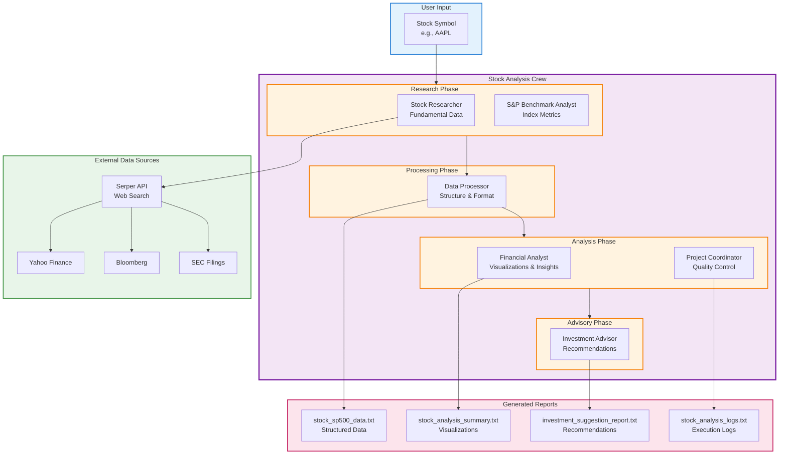
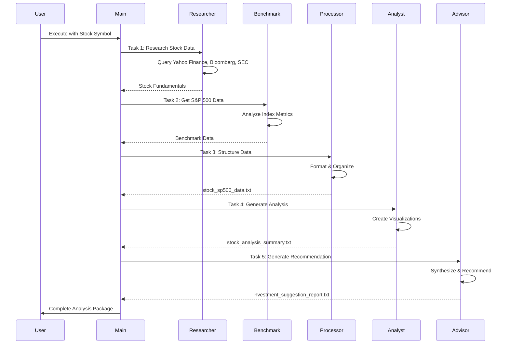

# Stock Researcher - CrewAI Project

**A Comprehensive AI-Powered Stock Analysis System with S&P 500 Benchmark Comparison**

This is an advanced CrewAI project that performs in-depth stock analysis by comparing individual stocks against S&P 500 benchmarks. It uses a coordinated team of AI agents to research, analyze, visualize, and generate investment recommendations with transparency about AI limitations.

---

## What This Project Does

This system automatically:
1. **Researches** detailed stock fundamentals and market data
2. **Retrieves** S&P 500 benchmark metrics for comparison
3. **Processes** raw data into structured, comparable formats
4. **Visualizes** performance metrics with professional graphs and tables
5. **Analyzes** performance gaps and comparative insights
6. **Generates** investment suggestions with clear AI disclaimers

**Perfect for:** Personal investment research, stock comparison analysis, and understanding relative performance metrics.

---

## Key Features

| Feature | Description |
|---------|-------------|
| **S&P 500 Comparison** | Compare any stock directly against S&P 500 benchmarks |
| **Comprehensive Metrics** | EPS, P/E ratio, sector PE, book value, price ranges, and more |
| **Professional Visualizations** | Python-generated graphs and comparison tables (matplotlib/seaborn) |
| **Multi-Source Research** | Data verified from Yahoo Finance, Bloomberg, SEC filings |
| **Structured Output** | Organized data files ready for further analysis |
| **AI Investment Suggestions** | BUY/HOLD/SELL recommendations (with important disclaimers) |
| **Execution Logs** | Complete tracking of analysis steps and decisions |
| **Transparent Disclaimers** | Clear warnings about AI limitations and accuracy |

---

## Quick Start

### Prerequisites
- Python 3.8+
- Virtual environment activated
- OpenAI API key
- Serper API key (for web search)

### Installation & Setup

1. **Activate Virtual Environment:**
   ```bash
   cd /Users/shinde/Desktop/Talbot/learning_crewai
   source venv/bin/activate
   ```

2. **Set Up Environment Variables:**
   Create a `.env` file in the `learning_crewai` root directory:
   ```bash
   OPENAI_API_KEY=sk-your-openai-api-key
   SERPER_API_KEY=your-serper-api-key
   ```

3. **Run Analysis:**
   ```bash
   cd stock_researcher/src
   python main.py "AAPL"
   ```

---

## API Keys Guide

### OpenAI API Key
- **Purpose**: Powers all AI agents and analysis
- **Get it**: https://platform.openai.com/api-keys
- **Free tier**: $5 free credits to start

### SERPER_API_KEY (Stock Research)
- **Purpose**: Enables web search for stock data and financial information
- **What it does**: Searches Yahoo Finance, Bloomberg, SEC filings for accurate data
- **Get it**: https://serper.dev/
- **Free tier**: 100 searches/month
- **Paid**: Starting at $5/month for 10,000 searches

**Setup Steps:**
1. Visit https://serper.dev/ and sign up
2. Go to API Key section in dashboard
3. Copy your API key
4. Add to `.env` file: `SERPER_API_KEY=your_key`

---

## Usage Guide

### Method 1: Command Line (Recommended)
Analyze any stock by passing the symbol as argument:
```bash
cd stock_researcher/src
python main.py "AAPL"      # Apple
python main.py "GOOGL"     # Google
python main.py "MSFT"      # Microsoft
python main.py "TSLA"      # Tesla
python main.py "AMZN"      # Amazon
```

### Method 2: Environment Variable
Set default stock in `.env`:
```bash
STOCK_SYMBOL=AAPL
```
Then run without arguments:
```bash
python main.py
```

### Method 3: Default Value
Run without arguments (defaults to AAPL):
```bash
python main.py
```

---

## Project Architecture

<div align="center">



</div>

### Execution Flow

<div align="center">



</div>

### File Structure

```
stock_researcher/
├── src/
│   ├── __init__.py                 # Package initialization
│   ├── main.py                     # Entry point with validation & logging
│   ├── crew.py                     # Crew configuration & agent setup
│   └── config/
│       ├── agents.yaml             # 6 agent definitions
│       └── tasks.yaml              # 5 task definitions
├── README.md                       # This file
└── Generated Output Files:
    ├── stock_sp500_data.txt        # Structured comparison data
    ├── stock_analysis_summary.txt   # Visualizations & analysis
    ├── investment_suggestion_report.txt  # Investment recommendations
    ├── stock_analysis_logs.txt     # Detailed execution logs
    └── stock_analysis.log          # Python application logs
```

---

## Agent System (6 Specialized Agents)

### 1. **Stock Researcher**
- **Role**: Stock Market Analyst & Financial Data Specialist
- **Responsibilities**:
  - Gathers comprehensive stock data using Serper API
  - Collects: EPS, P/E ratio, book value, sector PE, price ranges
  - Verifies data from multiple reliable sources
  - Organizes findings in structured format
- **Data Sources**: Yahoo Finance, Bloomberg, SEC filings

### 2. **S&P Benchmark Analyst**
- **Role**: Index Specialist & Benchmark Expert
- **Responsibilities**:
  - Analyzes S&P 500 index performance
  - Retrieves index metrics and sector performance
  - Provides industry-specific benchmarks
  - Calculates performance baselines for comparison
- **Output**: Comparative benchmark data

### 3. **Data Processor**
- **Role**: Data Organization & Formatting Specialist
- **Responsibilities**:
  - Structures raw stock and S&P 500 data
  - Creates comparison-ready formats
  - Organizes data into tables and matrices
  - Ensures data consistency and accuracy
- **Output**: stock_sp500_data.txt

### 4. **Financial Data Analyst**
- **Role**: Visualization & Comparative Analysis Specialist
- **Responsibilities**:
  - Creates professional visualizations (graphs, charts)
  - Generates comparison tables
  - Identifies over/underperformance
  - Provides trend analysis
- **Tools**: Python (matplotlib, seaborn)
- **Output**: stock_analysis_summary.txt

### 5. **Project Coordinator**
- **Role**: Workflow Manager & Quality Overseer
- **Responsibilities**:
  - Manages task dependencies
  - Tracks workflow progress
  - Ensures quality standards
  - Coordinates between agents
- **Feature**: Receives execution callbacks for monitoring

### 6. **Investment Advisor** (WARNING)
- **Role**: Investment Recommendation Specialist
- **Responsibilities**:
  - Synthesizes all research and analysis
  - Generates BUY/HOLD/SELL recommendations
  - Provides confidence levels (1-10)
  - Analyzes risk factors and opportunities
  - **Includes critical disclaimers** about AI limitations
- **Output**: investment_suggestion_report.txt

---

## Workflow Process

```
┌──────────────────┐
│ Stock Research   │  (Gather stock data via Serper)
└────────┬─────────┘
         │
         ├──────────────────┬──────────────────────┐
         │                  │                      │
         ▼                  ▼                      ▼
    ┌─────────┐    ┌──────────────┐    ┌──────────────┐
    │ Stock   │    │ S&P 500      │    │ Data         │
    │ Metrics │    │ Benchmarks   │    │ Organization │
    └────┬────┘    └──────┬───────┘    └──────┬───────┘
         │                │                   │
         └────────────────┴───────────────────┘
                        │
                        ▼
         ┌──────────────────────────────┐
         │ Data Preparation & Structuring│
         │ (Organize comparison data)   │
         └──────────────┬───────────────┘
                        │
                        ▼
         ┌──────────────────────────────┐
         │ Visualization & Comparison   │
         │ (Create graphs & analysis)   │
         └──────────────┬───────────────┘
                        │
                        ▼
         ┌──────────────────────────────┐
         │ Investment Suggestions (WARNING)│
         │ (BUY/HOLD/SELL + Disclaimers)│
         └──────────────────────────────┘
```

---

## Output Files Explained

| File | Size | Purpose |
|------|------|---------|
| **stock_sp500_data.txt** | ~2.3 KB | Structured comparison data table with all metrics |
| **stock_analysis_summary.txt** | ~2.8 KB | Python visualization code and analysis insights |
| **investment_suggestion_report.txt** | ~3.7 KB | Investment recommendations (BUY/HOLD/SELL) with detailed analysis |
| **stock_analysis_logs.txt** | ~20 KB | Complete execution logs with all agent actions |
| **stock_analysis.log** | Variable | Python logging output with timestamps |

### Example Report Contents

**stock_sp500_data.txt** includes:
- Comparison tables (AAPL vs S&P 500)
- Key metrics side-by-side
- Performance analysis
- Data validation

**investment_suggestion_report.txt** includes:
- Investment recommendation (BUY/HOLD/SELL)
- Confidence level (1-10)
- Key supporting factors
- Risk assessment
- Price targets
- Bullish & bearish scenarios
- **WARNING: CRITICAL DISCLAIMERS** about AI limitations

---

## Important: AI Disclaimers & Limitations

### Critical Warnings
- AI analysis **may be completely incorrect**
- Cannot account for **sudden market events**
- Market conditions change **rapidly and unpredictably**
- Cannot predict **economic crises or black swan events**
- Does not consider your **personal financial situation**
- Not a substitute for **professional financial advice**

### What To Do
- Treat all suggestions as **exploratory research only**
- Conduct your own **due diligence**
- Consult with **qualified financial advisors**
- Consider your **risk tolerance and goals**
- Never invest money you **cannot afford to lose**

### Recommended Workflow
1. Use this tool to **gather and organize data**
2. Review the **visualizations and metrics**
3. Read the **AI investment suggestions**
4. **Verify independently** with other sources
5. **Consult professionals** before investing
6. Make **informed decisions** based on complete research

---

## Configuration

### agents.yaml
Defines 6 AI agents with:
- **role**: Agent's professional role
- **goal**: Specific objectives
- **backstory**: Agent persona and expertise

### tasks.yaml
Defines 5 sequential tasks with:
- **description**: Task instructions
- **expected_output**: Output specifications
- **agent**: Assigned agent
- **context**: Dependencies on other tasks

### Environment Variables
Required in `.env`:
```bash
OPENAI_API_KEY=sk-...           # Required for AI processing
SERPER_API_KEY=...              # Required for web search
STOCK_SYMBOL=AAPL               # Optional: default stock
```

---

## Example Analysis Results

### For AAPL (Apple Inc.):

**Key Metrics:**
- Current Price: $284.10
- 52-Week Range: $169.21 - $288.62
- EPS: $7.46 (above sector average)
- P/E Ratio: 37.63 (premium vs S&P 500)
- Market Cap: $4.2 Trillion

**Recommendation:** HOLD (Confidence: 7/10)
- **Rationale**: Strong earnings but potentially overvalued
- **Price Target (6M)**: $300
- **Price Target (12M)**: $320
- **Risk Level**: Moderate-to-High

---

## Troubleshooting

### Issue: "Missing required environment variables"
**Solution**: Ensure `.env` file has both OPENAI_API_KEY and SERPER_API_KEY

### Issue: "Stock symbol not found"
**Solution**: Verify ticker symbol is correct (e.g., AAPL, GOOGL, MSFT)

### Issue: "Rate limit exceeded"
**Solution**: Wait for Serper API quota to reset or upgrade plan

### Issue: "No output files generated"
**Solution**: Check logs in `stock_analysis_logs.txt` for error details

---

## Support & Resources

- **CrewAI Documentation**: https://docs.crewai.com/
- **Serper API Docs**: https://serper.dev/docs
- **OpenAI API Docs**: https://platform.openai.com/docs
- **Financial Data Sources**: Yahoo Finance, Bloomberg, SEC EDGAR

---

## License & Disclaimer

This tool is for educational and research purposes. All investment suggestions are AI-generated and may be incorrect. Always consult with qualified financial professionals before making investment decisions.

**Remember**: Past performance does not guarantee future results. Invest responsibly.

---

**Last Updated**: December 5, 2025
**Version**: 1.0
**Status**: Fully Functional

## Workflow

```
Stock Research ──┐
                 ├─> Data Preparation ──> Visualization & Comparison ──> Investment Suggestions
S&P Benchmark ──┘
```

## Key Metrics Analyzed

- **Valuation Metrics**: P/E ratio, EPS, book value, sector PE ratio
- **Price Data**: Current price, 52-week high, 52-week low
- **Performance**: Trends, technical indicators, market sentiment
- **Benchmarks**: S&P 500 comparisons, sector performance, industry averages

## Output Files

1. **stock_sp500_data.txt** - Structured comparison data
2. **stock_analysis_summary.txt** - Visualization analysis and insights
3. **investment_suggestion_report.txt** - AI investment recommendations (with disclaimers)
4. **Generated Graphs** - Professional comparison visualizations
5. **Comparison Tables** - Side-by-side metric comparison

## Investment Suggestions & Disclaimers

**IMPORTANT DISCLAIMER**: The Investment Advisor agent provides AI-generated suggestions that include:

- **BUY/HOLD/SELL Recommendations** with confidence levels
- **Key Risk Factors** and opportunity assessment
- **Price Targets** and investment timeframes
- **Bullish and Bearish Cases** with scenario analysis

**CRITICAL LIMITATIONS**:
- AI analysis may be completely incorrect
- Market conditions change rapidly and past analysis becomes outdated
- Cannot predict unforeseen events or market crashes
- Does not consider your personal financial situation, risk tolerance, or goals
- Should NOT be used as the sole basis for investment decisions

**Recommendation**: 
- Treat these as exploratory suggestions for personal research only
- Consult with qualified financial advisors before making investment decisions
- Conduct your own due diligence and risk assessment
- Never invest money you cannot afford to lose

## Features

- **Accurate Data**: Multi-source verification for reliability
- **Professional Analysis**: Investment-grade analysis quality
- **Clear Visualizations**: Python-generated graphs suitable for reports
- **Comprehensive Comparison**: Stock vs S&P 500 benchmark analysis
- **Structured Output**: Organized, easy-to-read analysis documents

