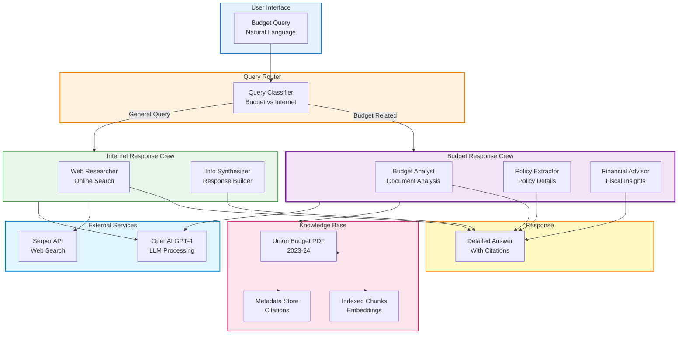
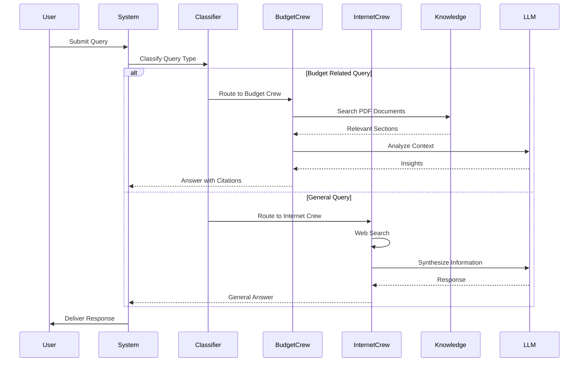

# Union Budget Knowledge Crew

[](https://www.python.org/downloads/)
[](https://crewai.com)
[](LICENSE)

> An enterprise-grade multi-agent AI system for analyzing and querying India's Union Budget documents using advanced natural language processing and collaborative AI agents.

## Table of Contents

- [Overview](#overview)
- [Features](#features)
- [Architecture](#architecture)
- [Prerequisites](#prerequisites)
- [Installation](#installation)
- [Configuration](#configuration)
- [Usage](#usage)
- [API Reference](#api-reference)
- [Project Structure](#project-structure)
- [Customization](#customization)
- [Troubleshooting](#troubleshooting)
- [Contributing](#contributing)
- [License](#license)

## Overview

Union Budget Knowledge Crew is a sophisticated CrewAI-based system designed to enable intelligent querying and analysis of Union Budget documents. It leverages multiple specialized AI agents that collaborate to:

- **Extract and Index** budget documents from PDF sources
- **Understand Context** through semantic analysis and knowledge graphs
- **Answer Complex Queries** with multi-step reasoning
- **Provide Insights** backed by official budget data
- **Support Research** with accurate citations and references

### Use Cases

- Budget policy analysis and comparison
- Fiscal allocation research
- Government spending tracking
- Financial planning and forecasting
- Academic research on public finance

## Features

- **Multi-Agent Architecture**: Specialized agents for different analytical tasks
- **PDF Processing**: Automatic extraction and indexing of Union Budget documents
- **Semantic Search**: Advanced knowledge retrieval using embeddings
- **Interactive Interface**: Real-time Q&A with streaming responses
- **Configurable Workflows**: YAML-based agent and task configuration
- **Error Handling**: Robust error management and recovery
- **Logging**: Comprehensive logging for debugging and monitoring
- **Extensible Design**: Easy to add new agents, tools, and data sources

## Architecture

<div align="center">



</div>

### Processing Flow

<div align="center">



</div>

## Prerequisites

### System Requirements
- **OS**: macOS, Linux, or Windows
- **Python**: 3.10, 3.11, 3.12, or 3.13
- **Memory**: Minimum 4GB RAM (8GB recommended)
- **Disk Space**: 2GB for dependencies and models

### Required API Keys
- **OpenAI API Key**: For GPT models (https://platform.openai.com/api-keys)
- **Serper API Key**: For web search capabilities (https://serper.dev)

### Existing Setup (Learning CrewAI Workspace)
This project is part of the `learning_crewai` workspace which provides:
- Shared virtual environment (`venv/`)
- Centralized `.env` configuration
- Common dependency management
- Shared logging configuration

## Installation

### 1. Prerequisites Check

Verify your Python version:
```bash
python3 --version  # Should be 3.10 or higher
```

### 2. Navigate to Project Directory

```bash
cd /Users/shinde/Desktop/Talbot/learning_crewai/union_budget_knowledge
```

### 3. Install Dependencies (if not already installed)

Using the workspace virtual environment:
```bash
# From the union_budget_knowledge directory
/Users/shinde/Desktop/Talbot/learning_crewai/venv/bin/pip install -r requirements.txt
```

Or install specific packages:
```bash
/Users/shinde/Desktop/Talbot/learning_crewai/venv/bin/pip install \
  crewai[tools]>=0.86.0 \
  litellm>=0.1.0 \
  PyPDF2>=3.0.1 \
  python-dotenv>=1.0.0
```

## Configuration

### Environment Setup

Create or update the `.env` file in the root `learning_crewai` directory:

```bash
# File: /Users/shinde/Desktop/Talbot/learning_crewai/.env

# OpenAI Configuration
OPENAI_API_KEY=sk-your_openai_api_key_here
OPENAI_MODEL_NAME=gpt-4  # or gpt-3.5-turbo

# Serper Search Configuration
SERPER_API_KEY=your_serper_api_key_here

# Project Settings (Optional)
LOG_LEVEL=INFO
DEBUG_MODE=false
```

### API Key Setup

#### OpenAI API Key
1. Visit https://platform.openai.com/api-keys
2. Create a new API key
3. Copy and add to `.env` file

#### Serper API Key
1. Visit https://serper.dev
2. Sign up for a free account
3. Navigate to API key section
4. Copy and add to `.env` file
5. Free tier includes 100 searches/month

### Verify Configuration

```bash
python3 -c "
import os
from dotenv import load_dotenv
load_dotenv('/Users/shinde/Desktop/Talbot/learning_crewai/.env')
print('OPENAI_API_KEY:', 'Set' if os.getenv('OPENAI_API_KEY') else 'Not Set')
print('SERPER_API_KEY:', 'Set' if os.getenv('SERPER_API_KEY') else 'Not Set')
"
```

## Usage

### Quick Start

Run the interactive Union Budget Knowledge system:

```bash
cd /Users/shinde/Desktop/Talbot/learning_crewai/union_budget_knowledge
PYTHONPATH=src /Users/shinde/Desktop/Talbot/learning_crewai/venv/bin/python \
  -c 'from union_budget_knowledge.main import kickoff; kickoff()'
```

### Interactive Mode

Once started, you'll see:
```
Flow started with ID: d03b98e0-21db-4b8e-8415-f96fa62dd57c

Please feel to ask me anything related to UNION BUDGET:
```

**Example queries:**
```
- What are the major budget allocations for education?
- How much is allocated for healthcare in 2023-24?
- What are the tax changes proposed in this budget?
- Explain the fiscal deficit targets
- Which sectors received the highest allocation?
```

### Programmatic Usage

Import and use in your Python code:

```python
from union_budget_knowledge.main import kickoff
from union_budget_knowledge.crews.budget_response_crew.budget_crew import UnionBudgetCrew

# Start interactive mode
kickoff()

# Or use the crew directly
crew = UnionBudgetCrew()
result = crew.crew().kickoff(inputs={"query": "Budget allocation for education"})
print(result)
```

## API Reference

### Main Functions

#### `kickoff()`
Starts the interactive Union Budget Knowledge system.

**Usage:**
```python
from union_budget_knowledge.main import kickoff
kickoff()
```

**Returns:**
- Interactive CLI session for querying the budget

### Crew Configuration

The `UnionBudgetCrew` class orchestrates all agents and tasks.

**Location:** `src/union_budget_knowledge/crews/budget_response_crew/budget_crew.py`

**Key Methods:**
- `union_budget_agent()` - Main budget analysis agent
- `crew()` - Returns the configured CrewAI Crew instance

## Project Structure

```
union_budget_knowledge/
├── src/
│   └── union_budget_knowledge/
│       ├── __init__.py
│       ├── main.py                          # Entry point & CLI handler
│       ├── crews/
│       │   └── budget_response_crew/
│       │       ├── __init__.py
│       │       ├── budget_crew.py           # Crew & agents definition
│       │       ├── internet_crew.py         # Internet search crew
│       │       └── config/
│       │           ├── agents.yaml          # Agent configurations
│       │           └── tasks.yaml           # Task definitions
│       └── tools/
│           └── custom_tools.py              # Custom tool implementations
│
├── Union_Budget_Analysis-2023-24.pdf        # Budget document source
├── README.md                                # This file
├── pyproject.toml                           # Project metadata & dependencies
├── uv.lock                                  # Dependency lock file
├── .gitignore                               # Git ignore rules
└── run_output.txt                           # Execution logs
```

### Key Files

| File | Purpose |
|------|---------|
| `main.py` | Entry point, handles CLI and flow initialization |
| `budget_crew.py` | Defines all agents and their configurations |
| `config/agents.yaml` | Agent roles, goals, and backstories |
| `config/tasks.yaml` | Task definitions and workflows |
| `Union_Budget_Analysis-2023-24.pdf` | Source document for analysis |

## Customization

### Adding New Agents

1. Edit `config/agents.yaml`:
```yaml
new_agent:
  role: "Specialized Agent Role"
  goal: "Specific goal for this agent"
  backstory: >
    Detailed backstory and expertise description
```

2. Add method in `budget_crew.py`:
```python
@agent
def new_agent(self) -> Agent:
    return Agent(
        config=self.agents_config["new_agent"],
        tools=[...]
    )
```

### Adding New Tasks

1. Edit `config/tasks.yaml`:
```yaml
new_task:
  description: "Task description"
  expected_output: "Expected output format"
  agent: new_agent
  context:
    - existing_task
```

2. Add method in `budget_crew.py`:
```python
@task
def new_task(self) -> Task:
    return Task(
        config=self.tasks_config["new_task"]
    )
```

### Updating PDF Source

Replace `Union_Budget_Analysis-2023-24.pdf` with a new document and update the path in:
- `budget_crew.py` line ~57: `pdf_path = Path(__file__).parent.parent.parent.parent / "YOUR_NEW_PDF.pdf"`

### Modifying Agent Behavior

Edit `config/agents.yaml` to change:
- `role`: The agent's professional role
- `goal`: What the agent aims to achieve
- `backstory`: Context and expertise information
- Add `tools` array for specific capabilities

## Troubleshooting

### Common Issues and Solutions

#### "ModuleNotFoundError: No module named 'union_budget_knowledge'"

**Solution:**
```bash
cd union_budget_knowledge
export PYTHONPATH=src
python -c "from union_budget_knowledge.main import kickoff; kickoff()"
```

#### "Could not find openai api key"

**Solution:**
1. Verify `.env` file exists at: `/Users/shinde/Desktop/Talbot/learning_crewai/.env`
2. Check the file contains: `OPENAI_API_KEY=sk-...`
3. Load environment manually:
```bash
export OPENAI_API_KEY=your_key_here
```

#### "No space left on device"

**Solution:**
1. Free disk space (delete cache, temp files, old logs)
2. Clear pip cache:
```bash
pip cache purge
```

#### LLM Stub Warning

If you see: "Mock response from litellm stub. Install the full litellm package..."

**Solution:**
Install the actual litellm package (requires disk space):
```bash
pip install --upgrade litellm
```

Or continue using the stub for development/testing (responses will be mocked).

#### PDF Parsing Issues

If PDF extraction fails:

**Solution:**
1. Verify PDF exists: `ls -lh Union_Budget_Analysis-2023-24.pdf`
2. Check PDF permissions: `chmod 644 Union_Budget_Analysis-2023-24.pdf`
3. Ensure PyPDF2 is installed:
```bash
pip install --upgrade PyPDF2
```

### Debug Mode

Enable detailed logging:

```bash
export LOG_LEVEL=DEBUG
PYTHONPATH=src python -c 'from union_budget_knowledge.main import kickoff; kickoff()'
```

### View Execution Logs

```bash
# Recent logs
tail -f run_output.txt

# Search for errors
grep -i error run_output.txt
```

## Performance Optimization

### For Large Queries
- Use specific keywords in questions
- Break complex queries into smaller sub-questions
- Reference specific budget sections when possible

### Caching
- Agents cache results internally
- Clear cache between sessions if using API quotas sparingly

### API Rate Limiting
- OpenAI: Monitor usage at https://platform.openai.com/account/usage
- Serper: Check quota at https://serper.dev/dashboard

## Contributing

### Development Workflow

1. Create a feature branch:
```bash
git checkout -b feature/new-feature
```

2. Make changes and test:
```bash
PYTHONPATH=src python -c 'from union_budget_knowledge.main import kickoff; kickoff()'
```

3. Update documentation:
   - Edit relevant `.yaml` files for configuration changes
   - Update this README for user-facing changes
   - Add docstrings for new functions

4. Commit and push:
```bash
git add .
git commit -m "feat: description of changes"
git push origin feature/new-feature
```

### Code Standards

- Follow PEP 8 style guide
- Add type hints to functions
- Document public methods with docstrings
- Keep functions focused and testable

## Monitoring and Logging

### Log Levels

| Level | Usage |
|-------|-------|
| DEBUG | Development and troubleshooting |
| INFO | General operation information |
| WARNING | Potentially problematic situations |
| ERROR | Errors that may affect functionality |

### Log Files

- `run_output.txt` - Latest execution logs
- Check application logs for agent actions

## Performance Metrics

Typical response times:
- Simple queries: 2-5 seconds
- Complex queries: 10-30 seconds
- PDF indexing: 1-2 seconds

Memory usage:
- Base: ~200MB
- With loaded budget: ~500MB
- Peak during processing: ~1GB

## Security Considerations

1. **API Keys**: Never commit `.env` to version control
2. **Rate Limiting**: Monitor API usage to prevent unexpected charges
3. **PDF Source**: Ensure budget documents are from official sources
4. **Input Validation**: User queries are processed safely by CrewAI

## License

This project is part of the Learning CrewAI workspace. See LICENSE file for details.

## Support and Resources

- **CrewAI Documentation**: https://docs.crewai.com/
- **OpenAI API Docs**: https://platform.openai.com/docs/
- **Serper API Docs**: https://serper.dev/docs
- **Union Budget Official**: https://www.indiabudget.gov.in/

## Changelog

### Version 1.0.0 (December 6, 2025)

- Initial release
- Multi-agent budget analysis system
- PDF document processing
- Interactive Q&A interface
- YAML-based configuration
- Comprehensive documentation

---

**Last Updated**: December 6, 2025
**Maintained By**: Shinde Vinayak Rao Patil

## Understanding the Crew

The Union Budget Knowledge Crew is composed of multiple AI agents, each with unique roles, goals, and tools:

1. **Budget or Internet Check Crew** - Classifies if a query is related to Union Budget or general internet knowledge
2. **Budget Response Crew** - Handles Union Budget related queries with detailed analysis
3. **Internet Response Crew** - Handles general knowledge queries using internet search

These agents collaborate on a series of tasks, leveraging their collective skills to achieve complex objectives. The config files outline the capabilities and configurations of each agent in the crew.


